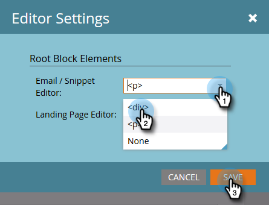

# Uso do Editor de Rich Text {#using-the-rich-text-editor}

O editor de rich text (RTE) é exibido em todo o Marketo e está disponível sempre que você deseja adicionar ou editar conteúdo. Você verá uma versão dele nas landing pages, programas, emails, formulários e trechos. Basta clicar em **Editar Rascunho**, que será exibido para você.

## Configurações do editor {#editor-settings}

A configuração do elemento de bloco raiz define quais tags vinculam seu conteúdo. Por padrão, o elemento de bloqueio raiz do email usa `
` tags. Você tem a opção de alterar isso seguindo as etapas abaixo.

>[!TIP]
>
>Embora você tenha a opção de escolher o elemento de bloco raiz, sempre recomendamos usar as configurações padrão para obter a melhor experiência do usuário.

1. Clique em **Administrador**.

   

1. Clique em **Email**.

   

1. Clique em **Editar Configurações do Editor de Texto**.

   

1. No menu suspenso **Email / Editor de trecho**, selecione `
` ou Nenhum e clique em **Salvar**. `
` é usado neste exemplo.

   

   Se você tiver `

` em um Modelo de email, verá o seguinte comportamento do HTML Source ao abrir a seção e digitar &quot;O texto é inserido aqui&quot; no editor:

<table> 
 <tbody> 
  <tr> 
   <th>&lt;p&gt;</th> 
   <th>&lt;div&gt;</th> 
   <th>Nenhum</th> 
  </tr> 
  <tr> 
   <td>
&lt;div class="mktEditable"&gt; &lt;p&gt;O texto é inserido aqui&lt;/p&gt; &lt;/div&gt;
</td> 
   <td>
&lt;div class="mktEditable"&gt; &lt;div&gt;O texto é inserido aqui&lt;/div&gt; &lt;/div&gt;
</td> 
   <td>
&lt;div class="mktEditable"&gt; O texto é inserido aqui &lt;/div&gt;
</td> 
  </tr> 
 </tbody> 
</table>

>[!TIP]
>
>Você também pode alterar o elemento de bloco raiz do Editor de páginas iniciais seguindo as mesmas etapas, mas clicando no menu suspenso **Editor de páginas iniciais** na Etapa 4 em vez de Email/Editor de trechos.

>[!NOTE]
>
>O elemento de bloco raiz é sempre `
` para tokens de programa rich text.

## Recursos {#features}

Estes são os recursos que você encontrará em um RTE.

| Ícone | Nome | O que faz |
|---|---|---|
|  | Família de fontes | Escolha o seu estilo — temos muito! |
|  | Tamanho da fonte | Quão grande você quer? 25 opções, de 8px a 90px. |
|  | Estilos | Escolha &#39;Parágrafo&#39; ou seis estilos de cabeçalho (para páginas iniciais). |
|  | Espaçamento entre linhas | Escolha a distância entre as linhas. |
|  | Cor do texto | Preto, vermelho, ou o que quiser. |
|  | Cor de fundo | Destaque para ênfase. |
|  | Negrito | **Mais escuro e mais grosso**. |
|  | Itálico | *Angled, para ênfase ou cotação* s. |
|  | Sublinhado | Coloca uma linha abaixo do texto. |
|  | Alinhamento | Use essa lista suspensa para dispor seu texto e imagens. Centralize-os, escolha o alinhamento à esquerda ou à direita ou espalhe-o de borda a borda com a justificação completa. |  |  | Lista | Escolha marcadores ou números na lista suspensa. Os marcadores são válidos para listas e números com etapas. |
|  | Recuar | Escolha mais ou menos recuo. Use para parágrafos ou qualquer texto que desejar destacar. |
|  | Inserir/editar link | Coloque um link para um site ou outro conteúdo; faça alterações facilmente. |
|  | Inserir/editar imagem | Uma imagem vale mais do que mil palavras. Solte um em. Clique no ícone de câmera para navegar no Design Studio. Você pode colocar imagens lado a lado. |
|  | Inserir token | Uma ferramenta eficiente, ideal para personalização de email e rastreamento de dados. Insira um valor padrão. |
|  | Desfazer | Ih! Vamos voltar uma etapa e tentar novamente. |
|  | Refazer | Se estiver tudo bem, retorne ao original. |
|  | Tabela | Construa o seu, como este aqui. Um menu suspenso permite configurá-lo. |
|  | Inserir Âncora | Solte a âncora! |
|  | Linha horizontal | Muitos usos - Ótimo para dividir seções. |
|  | Editar HTML | Exibe o Editor de Source do HTML para que você possa ajustar seu código. |
|  | Subscrito | Letras baixas (como em O`2`). |
|  | Sobrescrito | Você tem o poder! (2`6`). |
|  | Tachado | `<s>Put a line through text, like this</s>`. |
|  | Caractere especial | Quer falar sobre euros? Matemática? Você tem 243 opções. |
|  | Localizar e substituir | Pesquise e altere as coisas com muito mais rapidez do que procurar cada instância por si mesmo. |
|  | Limpar Formatação | Devolva as coisas ao padrão. |
|  | Cancelar | Pressione o botão para dizer: &quot;Não importa.&quot; |
|  | Salvar | Pressione o botão para dizer: &quot;OK, eu gostei.&quot; |

>[!TIP]
>
>Você edita seu HTML e texto em telas separadas. Certifique-se de clicar em **Copiar do HTML** na guia **Texto** e em **Salvar** para que o texto corresponda ao HTML.

>[!NOTE]
>
>Você não está limitado às fontes no menu suspenso. Você pode usar um não listado acessando o código HTML. Todas as fontes da Web são compatíveis com o Marketo, mas as fontes da Web não funcionam universalmente em todos os clientes de email.

## Páginas de aterrissagem {#landing-pages}

A configuração do elemento de bloco raiz define quais tags vinculam seu conteúdo. Por padrão, o elemento de bloco raiz da página de aterrissagem usa `
` tags. Você tem a opção de alterar isso, seguindo as etapas abaixo.

>[!TIP]
>
>Embora você tenha a opção de escolher o elemento de bloco raiz, sempre recomendamos usar as configurações padrão para obter a melhor experiência do usuário.

1. Clique em **Administrador**.

   

1. Clique em **Email**.

   

1. Clique em **Editar Configurações do Editor de Texto**.

   

1. No menu suspenso **Editor de Landing Page**, selecione `
` ou Nenhum e clique em **Salvar**. `
` é usado neste exemplo.

   

   E é isso!
