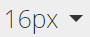

# Uso do Editor de Rich Text {#using-the-rich-text-editor}

O Editor de Rich Text (RTE) é exibido em todo o Marketo e está disponível sempre que você deseja adicionar ou editar conteúdo. Você verá uma versão dela em landing pages, programas, emails, formulários e trechos. Basta clicar em **Editar rascunho** E vai aparecer para te servir.

## Configurações do editor {#editor-settings}

A configuração do elemento de bloco raiz define quais tags vinculam seu conteúdo. Por padrão, o elemento de bloco raiz de email usa `
` tags. Você tem a opção de alterar isso seguindo as etapas abaixo.

>[!TIP]
>
>Embora você tenha a opção de escolher seu elemento de bloco raiz, sempre recomendamos usar as configurações padrão para a melhor experiência do usuário.

1. Clique em **Administrador**.

   

1. Clique em **Email**.

   

1. Clique em **Editar configurações do editor de texto**.

   

1. No **Editor de email/trecho** , selecione `
` ou Nenhum e clique em **Salvar**. `
` é usada neste exemplo.

   

   Se tiver `

` em um modelo de email, você verá o seguinte comportamento de HTML Source ao abrir a seção e digitar &quot;Text Goes Here&quot; no editor:

<table> 
 <tbody> 
  <tr> 
   <th>&lt;p&gt;</th> 
   <th>&lt;div&gt;</th> 
   <th>Nenhum</th> 
  </tr> 
  <tr> 
   <td>
&lt;div class="“mktEditable”"&gt; &lt;p&gt;O texto fica aqui&lt;/p&gt; &lt;/div&gt;
</td> 
   <td>
&lt;div class="“mktEditable”"&gt; &lt;div&gt;O texto fica aqui&lt;/div&gt; &lt;/div&gt;
</td> 
   <td>
&lt;div class="“mktEditable”"&gt; O texto fica aqui &lt;/div&gt;
</td> 
  </tr> 
 </tbody> 
</table>

>[!TIP]
>
>Você também pode alterar o elemento de bloco raiz do Editor de página inicial seguindo as mesmas etapas, mas clicando no botão **Editor de página de aterrissagem** na Etapa 4, em vez do Editor de email/trecho.

>[!NOTE]
>
>O elemento de bloco raiz é sempre `
` para tokens de programa rich text.

## Recursos {#features}

Estes são os recursos que você encontrará em um RTE.

| Ícone | Nome | O que ele faz |
|---|---|---|
|  | Família de fontes | Escolha o seu estilo, temos muito! |
|  | Tamanho da fonte | Quão grande você quer? 25 opções, de 8px a 90px. |
|  | Estilos | Escolha os estilos Parágrafo ou Seis Cabeçalhos (para landing pages). |
|  | Espaçamento entre linhas | Escolha a distância entre as linhas. |
|  | Cor do texto | Preto, vermelho, ou o que quiser. |
|  | Cor de fundo | Destaque para ênfase. |
|  | Negrito | **Mais escuro e espesso**. |
|  | Itálico | *Angular, para ênfase ou cotação* s. |
|  | Sublinhado | Coloca uma linha sob o texto. |
|  | Alinhamento | Use essa lista suspensa para dispor o texto e as imagens. Centralize-os, escolha o alinhamento à esquerda ou à direita ou expanda-o de ponta a ponta com justificação completa. |  |  | Lista | Escolha marcadores ou números na lista suspensa. Os marcadores são bons com listas e números com etapas. |
|  | Recuar | Escolha mais ou menos recuo. Use para parágrafos ou qualquer texto que desejar destacar. |
|  | Inserir/editar link | Colocar um link em um site ou outro conteúdo; faça alterações facilmente nele. |
|  | Inserir/editar imagem | Uma imagem vale mil palavras. Solte um. Clique no ícone da câmera para navegar pelo Design Studio. Você pode soltar imagens lado a lado. |
|  | Inserir token | Uma ferramenta poderosa, excelente para personalização de email e rastreamento de dados. Certifique-se de inserir um valor padrão. |
|  | Desfazer | Ih! Vamos voltar um passo e tentar de novo. |
|  | Refazer | Se estiver muito bem como está, volte ao original. |
|  | Tabela | Construa o seu, como este. Um menu suspenso permite configurá-lo. |
|  | Inserir âncora | Solte a âncora! |
|  | Linha horizontal | Muitos usos - Excelente para divisão de seções. |
|  | Editar HTML | Aperte o Editor de fonte HTML para ajustar o código. |
|  | Subscrito | Letras com baixo deslocamento (como em O`2`). |
|  | Sobrescrito | Você tem o poder! (2`6`). |
|  | Tachado | `<s>Put a line through text, like this</s>`. |
|  | Caractere especial | Quer falar de euros? Matemática? Você tem 243 escolhas. |
|  | Localizar e substituir | Procure e altere as coisas muito mais rápido do que procurar cada instância por conta própria. |
|  | Limpar Formatação | Retorne as coisas para o padrão. |
|  | Cancelar | Pressione o botão para dizer, &quot;Esqueça.&quot; |
|  | Salvar | Pressione o botão para dizer, &quot;OK, eu gosto.&quot; |

>[!TIP]
>
>Você edita o HTML e o texto em telas separadas. Certifique-se de clicar em **Copiar do HTML** no **Texto** e depois **Salvar** assim, seu texto corresponde ao HTML.

>[!NOTE]
>
>Você não está limitado às fontes no menu suspenso . Você pode usar um não listado acessando o código HTML. Todas as fontes da Web são compatíveis com o Marketo, mas as fontes da Web não funcionam universalmente em todos os clientes de email.

## Páginas {#landing-pages}

A configuração do elemento de bloco raiz define quais tags vinculam seu conteúdo. Por padrão, o elemento de bloco raiz da página de aterrissagem usa `
` tags. Você tem a opção de alterar isso seguindo as etapas abaixo.

>[!TIP]
>
>Embora você tenha a opção de escolher seu elemento de bloco raiz, sempre recomendamos usar as configurações padrão para a melhor experiência do usuário.

1. Clique em **Administrador**.

   

1. Clique em **Email**.

   

1. Clique em **Editar configurações do editor de texto**.

   

1. No **Editor de página de aterrissagem** , selecione `
` ou Nenhum e clique em **Salvar**. `
` é usada neste exemplo.

   

   E é isso!
