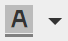

# Uso do Editor de Rich Text {#using-the-rich-text-editor}

O Editor de Rich Text (RTE) é exibido em todo o Marketing e está disponível sempre que você deseja adicionar ou editar conteúdo. Você verá uma versão dele no landing page, programas, emails, formulários e trechos. Basta clicar em **Editar rascunho** e ele aparecerá para servir a você.

## Configurações do editor {#editor-settings}

A configuração do elemento de bloco raiz define quais tags vinculam seu conteúdo. Por padrão, o elemento do bloco raiz de email utiliza 
 tags. Você tem a opção de alterar isso seguindo as etapas abaixo.

>[!TIP]
>
>Embora você tenha a opção de escolher seu elemento de bloco raiz, recomendamos sempre usar as configurações padrão para a melhor experiência do usuário.

1. Clique em **Admin**.

   

1. Clique em **Email**.

   

1. Clique em **Editar configurações** do editor de texto.

   

1. Na lista suspensa **Email / Editor** de fragmentos, selecione 
 ou Nenhum e clique em **Salvar**. 
 é usada neste exemplo.

   

   Se você tiver 

 em um modelo de e-mail, você verá o seguinte comportamento de Origem HTML ao abrir a seção e digitar &quot;O texto vai para aqui&quot; no editor:

<table> 
 <tbody> 
  <tr> 
   <th>&lt;p&gt;</th> 
   <th>&lt;div&gt;</th> 
   <th>Nenhum</th> 
  </tr> 
  <tr> 
   <td>
&lt;div class="mktEditable"&gt; &lt;p&gt;O texto entra aqui&lt;/p&gt; &lt;/div&gt;
</td> 
   <td>
&lt;div class="mktEditable"&gt; &lt;div&gt;O texto entra aqui&lt;/div&gt; &lt;/div&gt;
</td> 
   <td>
&lt;div class="mktEditable"&gt;O texto entra aqui &lt;/div&gt;
</td> 
  </tr> 
 </tbody> 
</table>

>[!TIP]
>
>Você também pode alterar o elemento de bloco raiz do Editor de Landings page seguindo as mesmas etapas, mas clicando no menu suspenso Editor **de** Landings page na Etapa 4 em vez de Email / Editor de fragmentos.

>[!NOTE]
>
>O elemento de bloco raiz é sempre 
 para tokens de programa Rich Text.

## Recursos {#features}

Estes são os recursos que você encontrará em um RTE.

| Ícone | Nome | O que ele faz |
|---|---|---|
|  | Família de fontes | Escolha o seu estilo - temos muito! |
|  | Tamanho da fonte | Quão grande você quer? 25 opções, de 8 px a 90 px. |
|  | Estilos | Escolha Parágrafo ou seis estilos de cabeçalho (para landing page). |
|  | Espaçamento entre linhas | Escolha sua distância entre as linhas. |
|  | Cor do texto | Preto, vermelho, ou o que quiser. |
|  | Cor do plano de fundo | Realce para realçar. |
|  | Negrito | **Mais escuro e mais espesso**. |
|  | Itálico | *Inclinado, para ênfase ou* citações. |
|  | Sublinhado | Coloca uma linha sob seu texto. |
|  | Alinhamento | Use essa lista suspensa para dispor o texto e as imagens. Centralize-os, escolha o alinhamento à esquerda ou à direita ou expanda-o de borda para borda com justificação completa. |  |  | Lista | Escolha marcadores ou números na lista suspensa. Os marcadores são bons com listas e números com etapas. |
|  | Recuo | Escolha mais ou menos recuo. Use para parágrafos ou qualquer texto que desejar destacar. |
|  | Inserir/Editar link | Colocar um link em um site ou outro conteúdo; faça alterações facilmente. |
|  | Inserir/Editar imagem | Uma imagem vale mil palavras. Largue um. Clique no ícone da câmera para navegar pelo Design Studio. Você pode soltar imagens lado a lado. |
|  | Inserir token | Uma ferramenta poderosa, excelente para personalização de email e rastreamento de dados. Certifique-se de inserir um valor padrão. |
|  | Desfazer | Oops! Vamos voltar um passo e tentar de novo. |
|  | Refazer | Se estiver tudo bem, volte ao original. |
|  | Tabela | Construa o seu, como este. Um menu suspenso permite configurá-lo. |
|  | Inserir âncora | Solte a âncora! |
|  | Linha horizontal | Muitos usos - Excelente para dividir seções. |
|  | Editar HTML | Exibe o Editor de código-fonte HTML para que você possa ajustar seu código. |
|  | Subscrito | Letras de baixo deslocamento (como em O`2`). |
|  | Sobrescrito | Você tem o poder! (2`6`). |
|  | Tachado | `<s>Put a line through text, like this</s>`. |
|  | Caractere especial | Quer falar de euros? Matemática? Você tem 243 escolhas. |
|  | Localizar e substituir | Procure e mude as coisas muito mais rápido do que procurar cada instância. |
|  | Limpar formatação | Retorne as coisas ao padrão. |
|  | Cancelar | Pressione o botão para dizer, &quot;Esqueça.&quot; |
|  | Salvar | Pressione o botão para dizer, &quot;OK, eu gosto.&quot; |

>[!TIP]
>
>Você edita seu HTML e texto em telas separadas. Certifique-se de clicar em **Copiar de HTML** na guia **Texto** e em **Salvar** para que o texto corresponda ao seu HTML.

>[!NOTE]
>
>Você não está limitado às fontes no menu suspenso. Você pode usar uma não listada acessando o código HTML. Todas as fontes da Web são suportadas no Marketo, mas as fontes da Web não funcionam universalmente em todos os clientes de email.

## landings page {#landing-pages}

A configuração do elemento de bloco raiz define quais tags vinculam seu conteúdo. Por padrão, o elemento do bloco raiz da landing page utiliza 
 tags. Você tem a opção de alterar isso seguindo as etapas abaixo.

>[!TIP]
>
>Embora você tenha a opção de escolher seu elemento de bloco raiz, recomendamos sempre usar as configurações padrão para a melhor experiência do usuário.

1. Clique em **Admin**.

   

1. Clique em **Email**.

   

1. Clique em **Editar configurações** do editor de texto.

   

1. Na lista suspensa Editor **de** Landings page, selecione 
 ou Nenhum e clique em **Salvar**. 
 é usada neste exemplo.

   

   E é isso!

