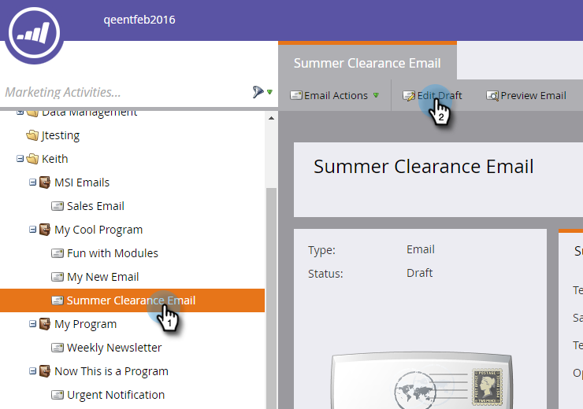

# Adicionar um token do sistema como um link em um email {#add-a-system-token-as-a-link-in-an-email}

Você pode usar esses tokens do sistema para personalizar a posição de links especiais em seus e-mails.

Os seguintes tokens podem ser usados como links em um modelo de email ou de email:

* `{{system.forwardToFriendLink}}`
* `{{system.unsubscribeLink}}`
* `{{system.viewAsWebpageLink}}`

>[!NOTE]
>
>Esses tokens **não** poderão ser clicados, a menos que estejam dentro de um link de âncora. Além disso, eles podem **e não** ser incorporados em um Meu token.

Veja como adicioná-los a um email:

1. Localize e selecione seu email e clique em **Editar rascunho**.

   

1. Duplo-clique em uma área editável.

   

1. Realce o texto que deseja converter em um link que terá o token e clique no botão **Inserir/Editar link**.

   

1. Insira o token no URL do link e clique em **Inserir**.

   

   >[!TIP]
   >
   >Copie/cole o token desejado: **`{{system.forwardToFriendLink}}`** ou **`{{system.unsubscribeLink}}`** ou **`{{system.viewAsWebpageLink}}`**

1. Clique em **Salvar**.

   

>[!NOTE]
>
>**Lembrete**
>
>Não se esqueça de [aprovar seu email](../../../../product-docs/email-marketing/general/creating-an-email/approve-an-email.md) quando terminar.

Muito bem! Agora você sabe como adicionar um token de sistema como um link em um email.