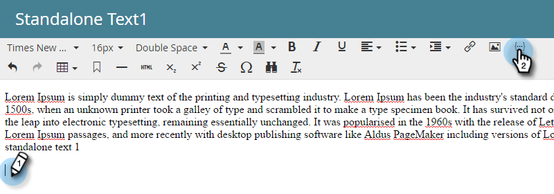

# Adicionar um token de script de email ao seu email {#add-an-email-script-token-to-your-email}

Depois de [criar seu script de email,](create-an-email-script-token.md)você desejará adicioná-lo a um email para vê-lo em ação. Veja como.

>[!NOTE]
>
>O tamanho total de todos os tokens de script inseridos em um único email não pode exceder 100 KB.

1. Vá para a área Atividades de marketing.

   

1. Localize e selecione o e-mail ao qual deseja adicionar o token e clique em Editar rascunho.

   

   >[!TIP]
   >
   >Você também pode adicionar o token a um modelo de email, se preferir.

1. Clique com o duplo na área editável à qual deseja adicionar o token.

   

1. Posicione o cursor no local desejado para o token e clique no ícone Inserir token.

   

1. Localize e selecione o token de script de email criado anteriormente e clique em Inserir.

   

   >[!TIP]
   >
   >Adicione um valor padrão, se desejar.

1. Clique em Salvar.

   

>[!NOTE]
>
>**Lembrete**
>
>Não se esqueça de [aprovar o email](../../../../product-docs/email-marketing/general/creating-an-email/approve-an-email.md).

É isso! Quando esse email for enviado, o script atrás do token será executado e o conteúdo será preenchido.
