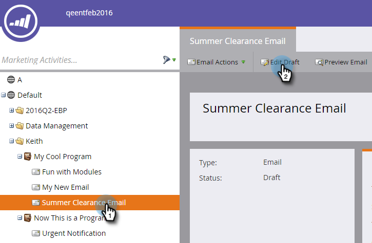
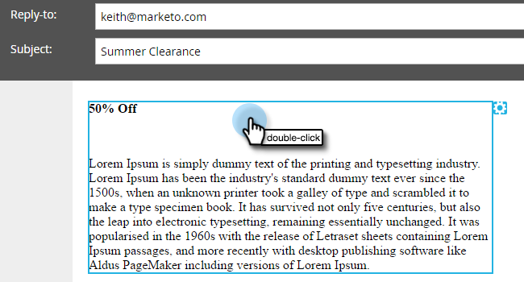
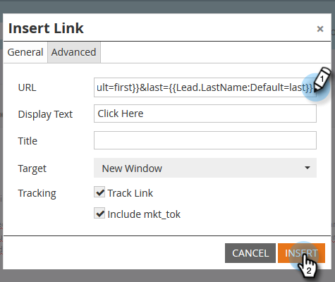

# Adicionar tokens a um link de email {#add-tokens-to-an-email-link}

Para inserir parâmetros extras e específicos de pessoas em seus links, é possível usar tokens. Veja como.

1. Selecione seu email e clique na guia **[!UICONTROL Editar rascunho]**.

   

1. Clique duas vezes em uma área editável.

   

1. Localize ou escreva o texto para o link. Destaque-o e clique no ícone **[!UICONTROL Inserir/Editar link]**.

   

1. Digite os tokens desejados em **[!UICONTROL URL]** e clique em **[!UICONTROL Inserir]**.

   

1. Clique em **[!UICONTROL Salvar]**.

   

   E é isso!

>[!MORELIKETHIS]
>
>[Usando URLs em Meus Tokens](/help/marketo/product-docs/email-marketing/general/using-tokens/using-urls-in-my-tokens.md)
