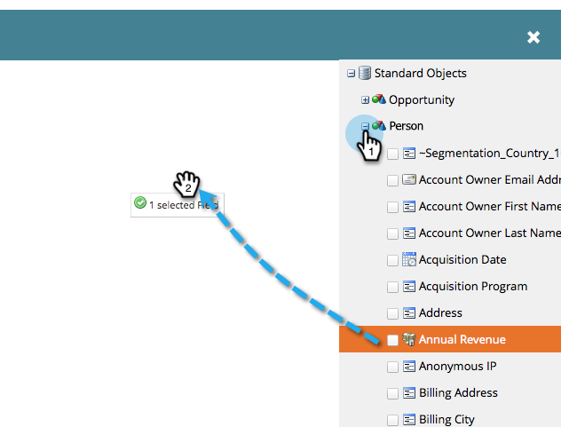
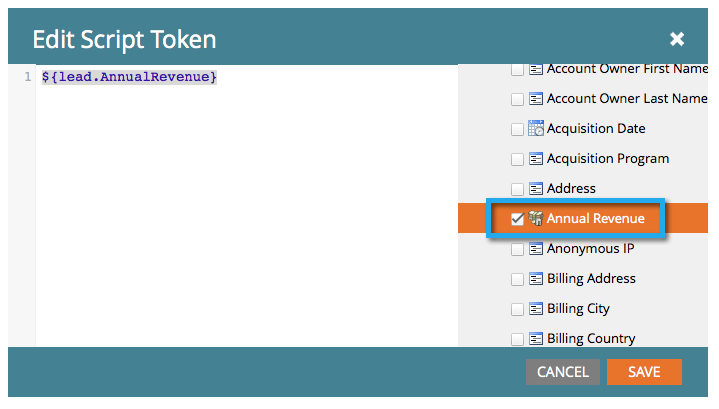

# Criar um token de script de email {#create-an-email-script-token}

Para desenvolvedores avançados, você pode usar scripts  Velocity em seus emails. Aqui está como fazer isso.

1. Vá para **Marketing Atividade**.

   

1. Localize e selecione qualquer programa (Evento, Padrão ou Envolvimento, etc.).

   

1. Na guia **Meus tokens** , arraste um token de script **de** email.

   

1. Nomeie seu token de script de email e **clique para editar** seu conteúdo.

   

1. Use a árvore à direita para arrastar os tokens **Pessoa, Oportunidade** ou Objeto **** personalizado.

   

   >[!NOTE]
   >
   >Ao acessar uma matriz (oportunidade ou objeto personalizado), você está limitado aos 10 itens mais recentes associados à pessoa.

1. Observe que o token fica marcado/ativo depois de arrastá-lo para o editor de scripts.

   

   >[!NOTE]
   >
   >**Lembrete**
   >
   >
   >Se você estiver digitando tokens de forma livre, verifique/ative todos os tokens correspondentes na árvore ou eles serão tratados como texto sem formatação e não funcionarão.

1. Escreva seu script no Velocity. Estes são alguns recursos úteis:

   * [Documentação de scripts de e-mail para desenvolvedores de marketing](http://developers.marketo.com/email-scripting/)
   * [Guia do usuário Velocity](http://velocity.apache.org/engine/devel/user-guide.html)
   * [Guia de referência de velocidade](http://velocity.apache.org/engine/devel/vtl-reference-guide.html)
   * [Velocity Tools Javadoc](http://velocity.apache.org/tools/releases/2.0/javadoc/index.html)

1. Quando o script for concluído, clique em **Salvar**.

   

1. Clique em **Salvar** mais uma vez.

   

Agora você pode usar este token em seus emails. Ele executará o script sempre que um email for enviado.

>[!MORELIKETHIS]
>
>* [Adicionar um token de script de email ao seu email](add-an-email-script-token-to-your-email.md)

>

