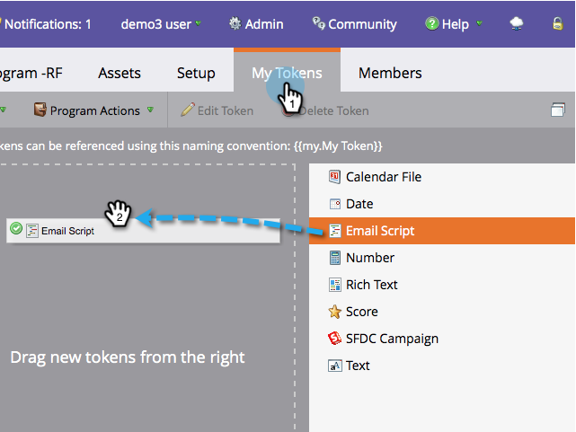

# Criar um token de script de email {#create-an-email-script-token}

Para desenvolvedores avançados, você pode usar os [scripts do Velocity](https://velocity.apache.org/engine/1.7/user-guide.html) nos seus emails. Veja como fazer isso.

1. Vá para **[!UICONTROL Atividades de marketing]**.

   

1. Localize e selecione qualquer programa (Evento, Padrão, Envolvimento etc.).

   

1. Na guia **[!UICONTROL Meus tokens]**, arraste um token de **[!UICONTROL Script de email]**.

   

1. Nomeie seu token de script de email e **[!UICONTROL Clique para Editar]** seu conteúdo.

   

1. Use a árvore à direita para arrastar os tokens de **[!UICONTROL Pessoa]**, **[!UICONTROL Oportunidade]** ou **[!UICONTROL Objeto Personalizado]**.

   

   >[!NOTE]
   >
   >Ao acessar uma matriz (oportunidade ou objeto personalizado), você está limitado aos 10 itens mais recentes associados à pessoa.

1. Observe que o token fica marcado/ativo depois de arrastá-lo para o editor de script.

   

   >[!NOTE]
   >
   >Se você estiver digitando tokens em formato livre, certifique-se de verificar/ativar todos os tokens correspondentes na árvore, caso contrário eles serão tratados como texto sem formatação e não funcionarão.

1. Escreva seu script no Velocity. Estes são alguns recursos úteis:

   * [Documentação de scripts de email de desenvolvedores do Marketo](https://experienceleague.adobe.com/en/docs/marketo-developer/marketo/email-scripting)
   * [Guia do usuário do Velocity](https://velocity.apache.org/engine/devel/user-guide.html)
   * [Guia de referência do Velocity](https://velocity.apache.org/engine/devel/vtl-reference-guide.html)
   * [Javadoc de ferramentas do Velocity](https://velocity.apache.org/tools/releases/2.0/javadoc/index.html)

1. Após concluir o script, clique em **[!UICONTROL Salvar]**.

   

1. Clique em **[!UICONTROL Salvar]** mais uma vez.

   

Agora você pode usar esse token em seus emails. Ele executará o script toda vez que um email for enviado.

>[!MORELIKETHIS]
>
>[Adicionar um token de script de email ao seu email](/help/marketo/product-docs/email-marketing/general/using-tokens/add-an-email-script-token-to-your-email.md)
