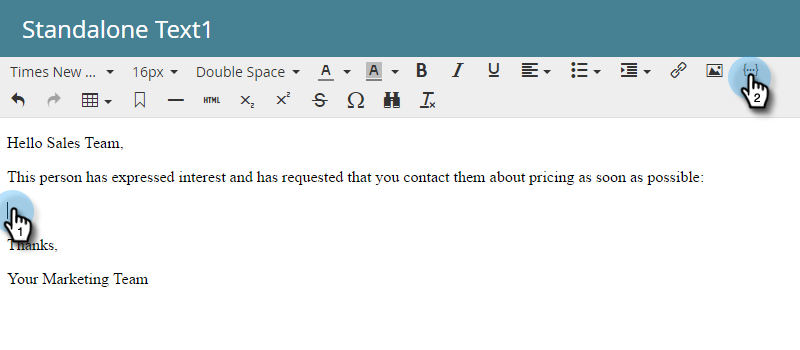

# Usar o token de envio de informações de alerta {#use-the-send-alert-info-token-sp-send-alert-info}

O token `{{SP_Send_Alert_Info}}` é um token especial a ser usado ao criar emails de alerta para a equipe de vendas.

>[!TIP]
>
>Este token funciona somente conforme o esperado ao enviar o email contendo-o com a etapa de fluxo [Enviar Alerta](/help/marketo/product-docs/core-marketo-concepts/smart-campaigns/flow-actions/send-alert.md). Ele não funcionará quando usado em uma etapa do fluxo Enviar email.

Exemplo de alerta:

>[!NOTE]
>
>Atenção! Os URLs nos alertas têm datas de expiração, portanto, verifique se têm uma cadência compatível com esses tipos de mensagens. As datas de expiração estão [configuradas por um Administrador](/help/marketo/product-docs/administration/settings/edit-link-expiration-in-reports-and-alerts.md).

As seguintes informações estão incluídas como parte de `{{SP_Send_Alert_Info}}`:

* Nome e sobrenome como um link para os detalhes da pessoa no Marketo
* Um link para a pessoa em seu CRM
* O nome da campanha no Marketo que enviou o alerta
* A hora em que o alerta foi enviado

>[!NOTE]
>
>O link para o CRM só aparecerá se a pessoa estiver no sistema CRM (atualmente não disponível com o Dynamics CRM). O link pode ser acessado por usuários Marketo e não-Marketo.

## Adicionar o token SP_Send_Alert_Info a um email {#add-the-sp-send-alert-info-token-to-an-email}

1. Selecione o email e clique em **Editar rascunho**.

   

1. Clique duas vezes na área editável à qual deseja adicionar o token.

   

1. Coloque o cursor onde deseja que o token fique e clique no botão **Inserir token**.

   

1. Localize e selecione o token **`{{SP_Send_Alert_Info}}`** e clique em **Inserir**.

   

1. Clique em **Salvar**.

   

>[!NOTE]
>
>Não se esqueça de aprovar seu e-mail.

Coisas boas! Esse token é muito útil e você deve usá-lo em todos os alertas criados para a equipe de vendas.
