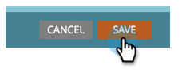

# Usar o token Enviar informações de alerta {#use-the-send-alert-info-token-sp-send-alert-info}

O `{{SP_Send_Alert_Info}}` token é um token especial a ser usado ao criar emails de alerta para sua equipe de vendas.

>[!NOTE]
>
>**FYI**
>
>O Marketo agora está padronizando o idioma em todas as subscrições, portanto você pode ver o lead/lead na sua subscrição e a pessoa/pessoas em docs.marketo.com. Estes termos significam a mesma coisa. isso não afeta as instruções do artigo. Há outras mudanças também. [Saiba mais](http://docs.marketo.com/display/DOCS/Updates+to+Marketo+Terminology).

>[!TIP]
>
>Este token só funciona conforme pretendido ao enviar o email que o contém com a etapa de fluxo de [Enviar alerta](../../../../product-docs/core-marketo-concepts/smart-campaigns/flow-actions/send-alert.md) . Ele não funcionará quando usado em uma etapa de fluxo Enviar e-mail.

Exemplo de alerta:   

>[!NOTE]
>
>Atenção! Os URLs em alertas têm datas de expiração, portanto, verifique se eles têm uma cadência compatível com esses tipos de mensagens. As datas de expiração são [configuradas por um Administrador](../../../../product-docs/administration/settings/edit-link-expiration-in-reports-and-alerts.md).

As seguintes informações são incluídas como parte do `{{SP_Send_Alert_Info}}`:

* Nome e sobrenome como um link para os detalhes da pessoa no Marketo
* Um link para a pessoa em seu CRM
* O nome da campanha no Marketo que enviou o alerta
* A hora em que o alerta foi enviado

>[!NOTE]
>
>O link para o CRM só será exibido se a pessoa estiver no sistema CRM (atualmente não disponível no Dynamics CRM). O link pode ser acessado por usuários do Marketing e não do Marketing.

## Adicionar o token SP_Send_Alert_Info a um email {#add-the-sp-send-alert-info-token-to-an-email}

1. Selecione o email e clique em **Editar rascunho**.

   

1. Clique com o duplo na área editável à qual deseja adicionar o token.

   

1. Posicione o cursor no local desejado para o token e clique no botão **Inserir token** .

   

1. Localize e selecione o **`{{SP_Send_Alert_Info}}`** token e clique em **Inserir**.

   

1. Clique em **Salvar**.

   

>[!NOTE]
>
>**Lembrete**
>
>Não se esqueça de aprovar seu email.

Que coisa boa! Esse token é muito útil e você deve usá-lo em todos os alertas criados para sua equipe de vendas.