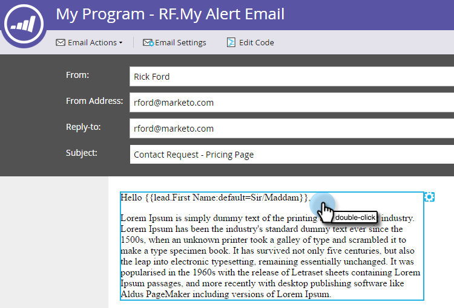

# Usar o token Enviar informações do alerta {#use-the-send-alert-info-token-sp-send-alert-info}

O `{{SP_Send_Alert_Info}}` token é um token especial a ser usado ao criar emails de alerta para sua equipe de vendas.

>[!TIP]
>
>Esse token só funciona conforme pretendido ao enviar o email que o contém com a variável [Enviar alerta](/help/marketo/product-docs/core-marketo-concepts/smart-campaigns/flow-actions/send-alert.md) etapa de fluxo. Ele não funcionará quando usado em uma etapa de fluxo Enviar email .

Exemplo de alerta:

>[!NOTE]
>
>Cabeça! Os URLs em alertas têm datas de expiração, portanto, verifique se eles têm uma cadência compatível com esses tipos de mensagens. As datas de expiração são [configurado por um Administrador](/help/marketo/product-docs/administration/settings/edit-link-expiration-in-reports-and-alerts.md).

As seguintes informações são incluídas como parte do `{{SP_Send_Alert_Info}}`:

* Nome e sobrenome como um link para os detalhes da pessoa no Marketo
* Um link para a pessoa em seu CRM
* O nome da campanha no Marketo que enviou o alerta
* A hora em que o alerta foi enviado

>[!NOTE]
>
>O link para o CRM será exibido somente se a pessoa estiver no sistema CRM (atualmente não disponível com o Dynamics CRM). O link é acessível para usuários do Marketo e de outros usuários.

## Adicionar o token SP_Send_Alert_Info a um email {#add-the-sp-send-alert-info-token-to-an-email}

1. Selecione o email e clique em **Editar rascunho**.

   

1. Clique duas vezes na área editável à qual deseja adicionar o token.

   

1. Coloque o cursor onde deseja que o token fique, em seguida, clique no botão **Inserir Token** botão.

   

1. Encontre e selecione o **`{{SP_Send_Alert_Info}}`** token e clique **Inserir**.

   

1. Clique em **Salvar**.

   

>[!NOTE]
>
>Não se esqueça de aprovar seu email.

Boa coisa! Esse token é muito útil e você deve usá-lo em todos os alertas que criar para sua equipe de vendas.
