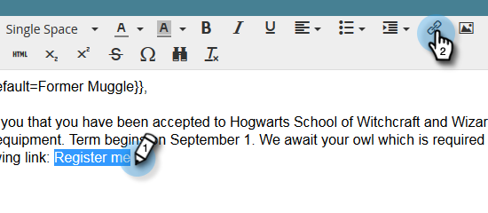

# Utilização de URLs em Meus tokens {#using-urls-in-my-tokens}

Siga as etapas abaixo para usar Meus tokens para inserir URLs em seus emails.

1. Selecione seu programa e clique em **Meus tokens**.

   

1. Selecione o **Texto** Meu token, arraste e solte-o na tela.

   

1. Dê um nome exclusivo ao token, insira uma URL (sem o https://) e clique em **Salvar**.

   

   >[!CAUTION]
   >
   >**Usando http/https...**
   >
   >* Para garantir que os cliques sejam rastreados em seu email, **não** digite o valor do token https:// _inside_. Use-o fora do token, como mostrado na Etapa 7.
   >
   >* É altamente recomendável não deixar de fora o http/https. Isso pode fazer com que a [versão da Web](/help/marketo/product-docs/email-marketing/general/functions-in-the-editor/add-a-view-as-web-page-link-to-an-email.md){target="_blank"} do seu email seja renderizada incorretamente.

1. Selecione o email no seu programa.

   

1. Clique em **Editar rascunho**.

   

1. Clique duas vezes na área de texto para editá-la.

   

1. Em qualquer lugar do email, digite `https://` (sem deixar um espaço depois de) e clique no ícone Inserir Token.

   

   >[!NOTE]
   >
   >É claro que você também tem a opção de inserir `http://` se o seu site não usar https.

1. Localize o Meu Token, selecione-o e clique em **Inserir**.

   

1. Realce o https:// e o token, depois pressione Ctrl/Cmd+X (Ctrl = Windows/Cmd = Mac) para cortar o texto.

   

1. Realce o texto que deseja que o link exiba e clique no ícone Insert/Edit Link.

   

1. Pressione Ctrl/Cmd+V para colar o conteúdo na caixa **URL** e clique em **Inserir**.

   

1. Clique em **Salvar**.

   

   E pronto! Seu URL será preenchido após o envio e, graças à colocação de https:// na frente do token, produzirá um link rastreável.
