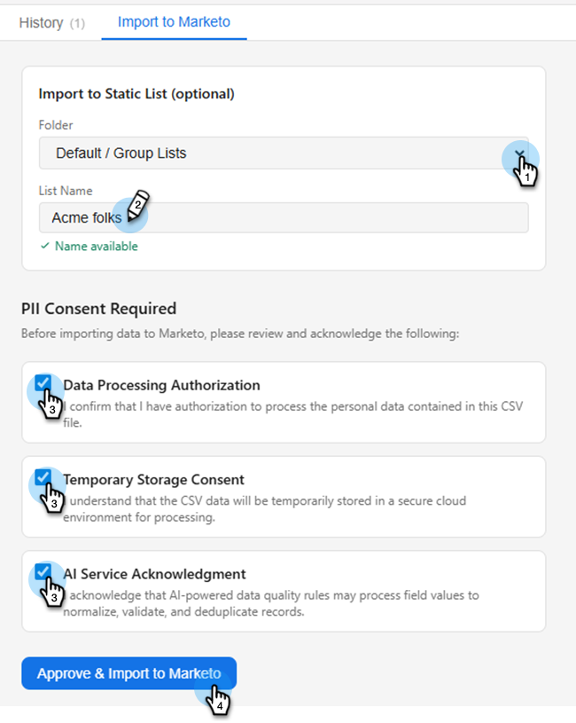

# Importar clientes em potencial {#import-leads}

Importe e desduplique listas de clientes potenciais no banco de dados do Marketo Engage com assistência de mapeamento de campo.

>[!NOTE]
>
>Esse recurso está na versão beta aberta e será implantado em fases nos próximos meses. Você saberá quando ele tiver sido habilitado para a sua assinatura ao visualizar um bloco _Build com IA_ na tela Minha Marketo.

## Como usar {#how-to-use}

1. Em Minha Marketo, clique no bloco **Criar com IA**.

   

1. Clique no agente **Importar clientes em potencial**.

   

   Você é direcionado à tela de IA de conversação. No painel esquerdo, o Agente publica orientações, respostas e opções para quais recursos de normalização de dados executar.

   

1. Para começar a importar seus clientes em potencial, clique no ícone de anexo e faça upload por meio do arquivo .CSV.

   

1. Digite _Lista de importações_ e clique em **Enviar**.

   

   Sua lista é visualizada no console central.

   

1. Insira uma regra de negócios desejada e clique em **Enviar**.

   

   Os resultados são exibidos no console central.

   

   Se desejar, insira regras de negócios adicionais.

1. Para exibir os campos mapeados, clique na guia **Mapeamentos**.

1. Se algum campo foi mapeado incorretamente, corrija-os aqui.

   

1. Quando estiver pronto para importar sua lista, clique na guia **Importar para o Marketo**.

1. Selecione a pasta de destino e digite um nome. Marque cada caixa de consentimento e clique em **Aprovar e importar para a Marketo**.

   

Quando a importação for concluída, a verificação receberá um resumo dos clientes potenciais processados, linhas com falha e avisos.
