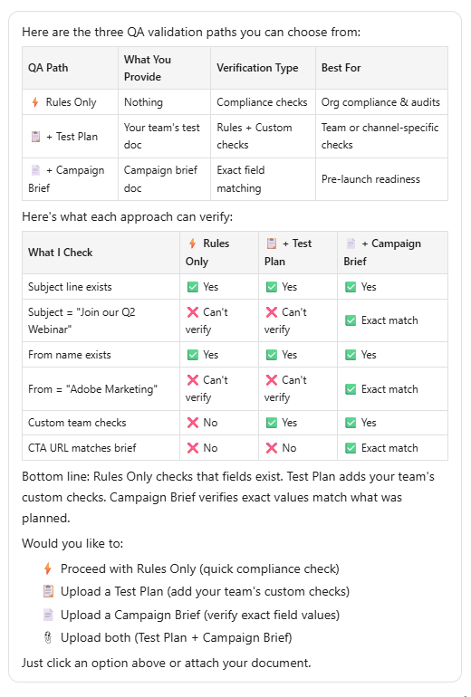

# Controle de qualidade do programa {#program-qa}

Faça auditoria de seus programas para obter as práticas recomendadas para todos os componentes, como emails, landing pages, campanhas e muito mais.

## Como usar {#how-to-use}

1. Em Minha Marketo, clique no bloco **Criar com IA**.

   

1. Selecione o agente **Controle de qualidade do programa**.

   

   Você é direcionado à tela de IA de conversação.

1. Selecione o programa que deseja controlar a qualidade no painel direito.

   {width="800" zoomable="yes"}

   Um resumo do programa é exibido no painel central, fornecendo uma visão geral do programa.

   {width="450" zoomable="yes"}

1. Na janela do prompt, digite &quot;Programa de controle de qualidade&quot; e clique em **Enviar**.

   

O Assistente de IA fornece um Controle de qualidade do programa selecionado, mostrando o que foi aprovado e o que falhou.

