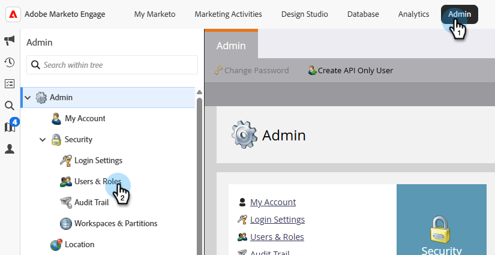
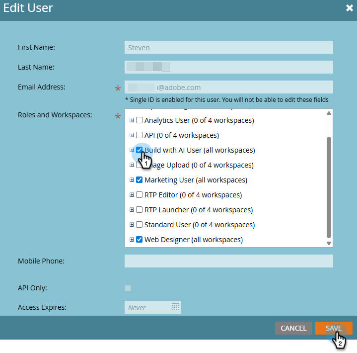

# Configurações e configuração {#settings-setup}

Saiba como habilitar permissões e usar a área Configurações para exibir detalhes de conexão, definir regras organizacionais e configurar integrações e notificações.

## Permissões e funções {#permission-and-role}

Há uma permissão de _Compilação de Acesso com IA_ e uma função de _Compilação com Usuário de IA_, dando aos administradores maior controle sobre quais usuários podem acessar o recurso **Compilação com IA**. A permissão é atribuída no nível da função. A função _Build com Usuário de IA_ vem com a permissão _Build de acesso com IA_ habilitada por padrão.

>[!IMPORTANT]
>
>A _Compilação de Acesso com a permissão AI_ não está habilitada por padrão para todas as funções. Consulte a tabela abaixo para obter detalhes.

| Função | Status padrão |
| --- | --- |
| Admin | Habilitado |
| Administrador de produtos da Adobe | Habilitado |
| Usuário de campanha de marketing | Desabilitado |
| Usuário padrão | Não disponível |
| Criar com usuário de IA | Habilitado |
| Funções personalizadas | Desabilitado |

### Permissão Acessar build com IA {#access-build-with-ai-permission}

Siga as etapas abaixo para habilitar a _Compilação de Acesso com IA_ para funções qualificadas que ainda não a tenham habilitada.

1. Em Meu Marketo, clique em **Administrador** e depois em **Usuários e funções**.

   

1. Na guia _Funções_, selecione a função desejada e clique em **Editar Função**.

   

1. Role para baixo e marque a caixa de seleção _Acessar compilação com IA_ e clique em **Salvar**.

   

   >[!NOTE]
   >
   >Você pode usar essas mesmas etapas para remover a permissão ao **executar** marcar a caixa de seleção _Acessar compilação com IA_.

### Criar com a função de usuário de IA {#build-with-ai-user-role}

Siga estas etapas para atribuir um usuário específico à função _Criar com Usuário de IA_.

>[!NOTE]
>
>Esta função **somente** contém a _Compilação de Acesso com a permissão AI_.

1. Em Meu Marketo, clique em **Administrador** e depois em **Usuários e funções**.

   

1. Selecione o usuário desejado e clique em **Editar Usuário**.

   

1. Em _Funções e Espaços de Trabalho_, marque a caixa de seleção _Criar com Usuário de IA_. Se você tiver mais de um espaço de trabalho, poderá especificar quais terão acesso no menu suspenso de assinaturas **+**. Clique em **Salvar** quando terminar.

   

### Função personalizada {#custom-role}

Você também tem a opção de [criar uma nova função](https://experienceleague.adobe.com/en/docs/marketo/using/product-docs/administration/users-and-roles/create-delete-edit-and-change-a-user-role#create-a-role){target="_blank"} e personalizar suas permissões, adicionando a _Compilação do Access com IA_, juntamente com qualquer outra coisa que desejar, e [atribuindo essa função](https://experienceleague.adobe.com/en/docs/marketo/using/product-docs/administration/users-and-roles/managing-user-roles-and-permissions#assign-roles-to-a-user){target="_blank"} a usuários específicos.

## Configurações {#settings}

1. Em Minha Marketo, clique no bloco **Criar com IA**.

   

1. Clique no ícone de engrenagem.

   

### Conexão {#connection}

Esta guia não contém campos editáveis. Ele mostra as informações da conta como sua Munchkin ID e Organização IMS.

### Regras organizacionais {#organizational-rules}

Defina as diretrizes e restrições organizacionais que a IA do Marketo segue ao criar ou modificar ativos do Marketo Engage.

{width="800" zoomable="yes"}

>[!NOTE]
>
>As regras usam o formato Markdown com o material de frente YAML. As regras globais se aplicam a todos os espaços de trabalho. As regras do Workspace substituem as configurações globais.

### Integrações (em breve) {#integrations}

Configure conexões com serviços e APIs externos.

_Esta guia pode aparecer na interface do usuário, mas ainda não está disponível para uso. Procure atualizações_.

### Notificações (em breve) {#notifications}

Gerencie preferências de alerta e canais de notificação.

_Esta guia pode aparecer na interface do usuário, mas ainda não está disponível para uso. Procure atualizações_.
