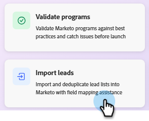

# Importar clientes em potencial {#import-leads}

Importe e desduplique listas de clientes potenciais no banco de dados do Marketo Engage com assistência de mapeamento de campo.

## Como usar {#how-to-use}

1. Em Meu Marketo, clique no bloco **IA do Marketo**.

   

1. Clique no agente **Importar clientes em potencial**.

   

   Você é direcionado à tela de IA de conversação. O painel esquerdo exibe orientações, respostas e opções de normalização de dados disponíveis.

   

1. Para começar a importar seus clientes potenciais, clique no ícone **+** e selecione **Carregar arquivo**. Localize e faça upload do seu arquivo CSV.

   

1. Clique no ícone de seta para cima.

   

1. Clique em **Revisar** para ver sua lista no console central.

   

1. Verifique as regras de negócios disponíveis para limpar sua lista. Insira o que você deseja e clique no ícone de seta para cima.

   

   Os resultados são exibidos no console central.

   

   Se desejar, insira regras de negócios adicionais.

1. Para exibir os campos mapeados, clique na guia **Mapeamentos**.

1. Se algum campo foi mapeado incorretamente, corrija-os aqui alterando o **Campo de destino**.

   

1. Quando estiver pronto para importar sua lista, clique na guia **Importar para o Marketo**.

1. Selecione a pasta de destino e digite um nome. Marque cada caixa de consentimento e clique em **Iniciar importação**.

   

   Quando a importação for concluída, um resumo de verificação será exibido mostrando clientes em potencial processados, linhas com falha e avisos.
