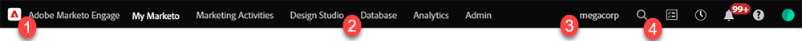

# Visão geral do Marketo Engage Modern UX {#overview}

Bem-vindo ao Adobe Marketo Engage Modern UX (experiência do usuário), uma interface atualizada que oferece usabilidade aprimorada, juntamente com uma nova aparência na plataforma Marketo Engage.

>[!PREREQUISITES]
>
>Se sua equipe de TI restringir o acesso à Web usando uma inclui na lista de permissões, peça que eles adicionem os seguintes domínios (incluindo o asterisco) para permitir todos os recursos e soquetes da Marketo:
>
>* *.marketo.com
>* *.marketodesigner.com
>* *.mktoweb.com

## Novidades {#whats-new}

Há uma série de novas funcionalidades no UX moderno, todas projetadas para melhorar significativamente sua experiência de marketing.

**Ícones**

A nova interface apresenta uma iconografia melhorada e expandida.

**Navegação global**

Adeus super bola. Agora você tem acesso rápido a todas as seções principais do Marketo Engage.

**URL da instância**

Você também tem acesso rápido à sua ID do munchkin, que agora é refletida no URL da sua instância (ainda mais útil para aqueles com várias assinaturas).

## Novas opções de árvore {#new-tree-options}

Há muitos recursos novos de árvore disponíveis.

>[!NOTE]
>
>Fazer uma pesquisa na árvore exibirá apenas os primeiros 250 resultados. Se após uma pesquisa você não conseguir localizar seu ativo, use a função [Pesquisa global](/help/marketo/product-docs/marketo-engage-modern-ux/using-the-global-search.md).

**Marketo Classic vs. a nova Marketo**

<table> 
 <tbody>
  <tr>
   <th>Recurso</th> 
   <th>Classic</th> 
   <th>Próxima geração</th> 
  </tr>
  <tr>
   <td>Aplicar vários filtros ao mesmo tempo</td> 
   <td></td> 
   <td><strong>X</strong></td>  
  </tr>
  <tr>
   <td>Nó de árvore de rascunho e aprovação combinado</td> 
   <td></td> 
   <td><strong>X</strong></td> 
  </tr>
  <tr>
   <td>Criar ativos locais em pastas de programas</td> 
   <td></td> 
   <td><strong>X</strong></td> 
  </tr>
  <tr>
   <td>Clique duas vezes para expandir/recolher os nós de árvore</td> 
   <td><strong>X</strong></td> 
   <td><strong>X</strong></td>  
  </tr>
  <tr>
   <td>Arrastar e soltar da árvore para o fluxo de envolvimento</td> 
   <td><strong>X</strong></td> 
   <td></td> 
  </tr>
  <tr>
   <td>Arrastar e soltar dentro da árvore</td> 
   <td><strong>X</strong></td> 
   <td><strong>X</strong></td> 
  </tr>
  <tr>
   <td>Filtrar por tipo de ativo e estados</td> 
   <td><i>parcial</i></td> 
   <td><strong>X</strong></td>  
  </tr>
  <tr>
   <td>Realçar plano de fundo para mostrar hierarquia no estado de foco</td> 
   <td></td> 
   <td><strong>X</strong></td> 
  </tr>
  <tr>
   <td>Realçar palavras-chave durante a pesquisa</td> 
   <td></td> 
   <td><strong>X</strong></td> 
  </tr>
  <tr>
   <td>Rolagem horizontal</td> 
   <td><strong>X</strong></td> 
   <td><strong>X</strong></td>  
  </tr>
  <tr>
   <td>Estado de passagem do mouse dos nós de árvore</td> 
   <td><strong>X</strong></td> 
   <td><strong>X</strong></td> 
  </tr>
  <tr>
   <td>Recolher rapidamente toda a árvore</td> 
   <td></td> 
   <td><strong>X</strong></td> 
  </tr>
  <tr>
   <td>Recolher rapidamente para o nó raiz</td> 
   <td></td> 
   <td><strong>X</strong></td>  
  </tr>
  <tr>
   <td>Atualização em tempo real</td> 
   <td></td> 
   <td><strong>X</strong></td> 
  </tr>
  <tr>
   <td>Árvore redimensionável</td> 
   <td><strong>X</strong></td> 
   <td><strong>X</strong></td> 
  </tr>
  <tr>
   <td>Pesquisar nas pastas arquivadas</td> 
   <td></td> 
   <td><strong>X</strong></td>  
  </tr>
  <tr>
   <td>String de pesquisa salva ao inserir pesquisa global da pesquisa em árvore</td> 
   <td></td> 
   <td><strong>X</strong></td> 
  </tr>
  <tr>
   <td>Mostrar todos os espaços de trabalho em uma única árvore</td> 
   <td><strong>X</strong></td> 
   <td><strong>X</strong></td> 
  </tr>
  <tr>
   <td>Selo de estado e dicas de ferramentas</td> 
   <td></td> 
   <td><strong>X</strong></td>  
  </tr>
  <tr>
   <td>Lógica de pesquisa "O Word começa com"</td> 
   <td></td> 
   <td><strong>X</strong></td> 
  </tr>
 </tbody>
</table>

## Navegação global {#global-nav}

Dê uma olhada na nova Navegação Global.

<table> 
 <tbody>
  <tr>
   <td>1</td> 
   <td>Sem mais lista suspensa de superbolas</td> 
  </tr>
  <tr>
   <td>2</td> 
   <td>Todos os itens de superball anteriores listados</td> 
  </tr>
  <tr>
  <tr>
   <td>3</td> 
   <td>Se você tiver várias assinaturas, clique no seu sub-nome para mudar facilmente para outro</td> 
  </tr>
  <tr>
   <td>4</td> 
   <td>Pesquisa global - agora é possível pesquisar toda a instância aqui</td> 
  </tr>
 </tbody>
</table>

>[!NOTE]
>
>Tudo o que costumava viver no menu suspenso do superball ainda está disponível como um bloco em My Marketo.

>[!TIP]
>
>Usar a pesquisa na árvore só produzirá resultados da seção em que você está (por exemplo, Atividades de marketing). Se quiser pesquisar toda a instância, use a pesquisa global.

Aproveite a nova experiência com o Marketo Engage!
