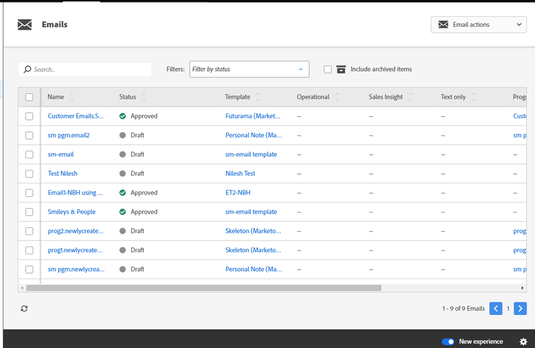

# Botão de alternância {#toggle-switch}

O botão de alternância permite alternar entre a interface clássica do Marketo e a experiência moderna. Ele está disponível em todas as áreas destacadas abaixo.

>[!NOTE]
>
>Quando o botão de alternância estiver selecionado, todos os fluxos de trabalho existentes serão salvos automaticamente antes de aplicar a alteração na interface. Se já existir uma operação em andamento (como um ativo em processo de aprovação), você receberá uma mensagem de erro indicando isso e deverá tentar novamente após a operação ser concluída.

## Habilitar o botão de alternância para funções individuais {#enable-the-toggle-switch-for-individual-roles}

Habilite o botão de alternância para funções individuais ou todas as funções. Veja como.

1. No Marketo Engage, clique em **[!UICONTROL Admin]**.

   

1. Clique em **[!UICONTROL Nova experiência]**.

   

1. Selecione as funções que você deseja que tenham acesso ao botão de alternância.

   

## Habilitar para recursos {#enable-for-features}

Você tem a opção de habilitar manualmente a experiência moderna do Marketo Engage para recursos individuais ou todos os recursos disponíveis (atuais e futuros).

Em uma área que atualmente contenha o botão de alternância (neste exemplo, a exibição de lista de email), clique no botão no canto inferior direito da página.

A nova experiência será carregada.

Para habilitá-la para _todos_ os recursos, clique no ícone de engrenagem ao lado do botão de alternância.

Selecione **[!UICONTROL Habilitar para todos os recursos disponíveis]** e clique em **[!UICONTROL OK]**.

## Recursos disponíveis {#available-features}

Os seguintes recursos estão disponíveis na experiência moderna (novos recursos são adicionados a cada versão):

* Exibição de detalhes do email
* Exibição da lista de emails
* Exibição de detalhes do modelo de email
* Lista de modelos de email
* Exibição do painel de teste de email
* Exibição dos detalhes do formulário
* Exibição da lista de formulários
* Página de detalhes de imagens e arquivos
* Exibição dos detalhes da página de destino
* Exibição da lista de páginas de destino
* Detalhes do modelo de página de destino
* Lista de modelos de página de destino
* Exibição de detalhes do snippet
* Exibição da lista de snippets
