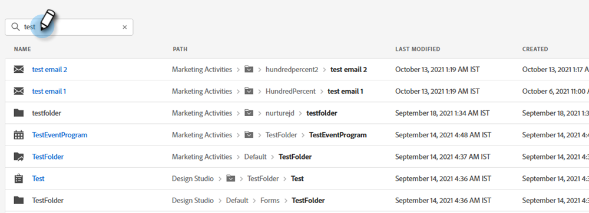
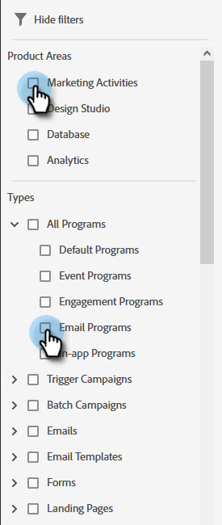

# Usando a Pesquisa global {#using-the-global-search}

A poderosa pesquisa global oferece muitas opções sem limite nos resultados exibidos.

## Realizando uma pesquisa {#performing-a-search}

1. Na Navegação global, clique no ícone de pesquisa.

   

1. Digite o texto de identificação do ativo.

   

1. Os resultados da pesquisa são exibidos. Você pode clicar em qualquer lugar em qualquer uma das navegações estruturais para ser levado diretamente a esse item.

   

1. Neste exemplo, optamos por receber diretamente o email que estamos procurando. Clique no nome do email.

   

Você é levado diretamente ao email desejado.

## Página de resultados da pesquisa {#search-results-page}

<table>
 <tbody>
  <tr>
   <td>1</td>
   <td>Nome do item/destino</td>
  </tr>
  <tr>
   <td>2</td>
   <td>Caminho (navegação estrutural) para o respectivo item/destino</td>
  </tr>
  <tr>
   <td>3</td>
   <td>Data e hora da última modificação do item/destino</td>
  </tr>
  <tr>
   <td>4</td>
   <td>Data e hora em que o item/destino foi criado</td>
  </tr>
  <tr>
   <td>5</td>
   <td>Implementar filtros focados para limitar os resultados da pesquisa</td>
  </tr>
 </tbody>
</table>

**ETAPA OPCIONAL**: para utilizar a filtragem, basta selecionar as opções desejadas.

