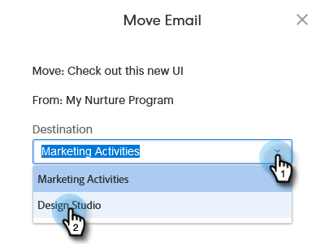

# Mover ativos {#moving-assets}

Arrastar e soltar não está disponível no momento, mas você ainda pode realocar ativos facilmente.

>[!NOTE]
>
>As pastas no Design Studio podem ser movidas dentro do mesmo espaço de trabalho, mas não entre espaços de trabalho no momento.

1. Na árvore, localize o ativo que deseja mover. Clique com o botão direito do mouse e selecione **Move**.

   

1. Escolha a seção de destino.

   

>[!NOTE]
>
>As opções subsequentes neste modal podem ser alteradas com base no **destination** que você escolher.

1. Escolha a pasta de destino.

   

1. Clique em **Mover**.

   

Simples assim!
