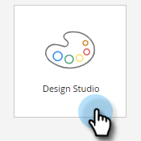
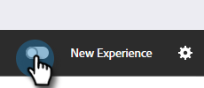

# Alternar Switch {#toggle-switch}

O Switch de alternância permite alternar entre a interface clássica do Marketo e a experiência de Marketo Engage de próxima geração. Está disponível em todas as áreas destacadas abaixo. A partir da versão de maio de 2022, a experiência da próxima geração será ativada por padrão.

>[!NOTE]
>
>Quando a opção Alternar switch estiver selecionada, todos os workflows existentes serão salvos automaticamente antes que a alteração da interface do usuário ocorra. Se uma operação já estiver em andamento (por exemplo: um ativo está em processo de aprovação), você receberá uma mensagem de erro indicando como tal e deverá tentar novamente após a conclusão da operação.

## Ativar a opção Alternar para funções individuais {#enable-the-toggle-switch-for-individual-roles}

Ative a opção de alternância para funções individuais ou todas as funções. Veja como.

1. No Marketo Engage, clique em **Administrador**.

   

1. Clique em **Nova experiência**.

   

1. Selecione as funções que você deseja que tenham acesso ao switch de alternância.

   

## Exibição de lista da página inicial {#landing-page-list-view}

A exibição de lista da próxima geração da Landing page oferece filtros de pesquisa e a capacidade de executar ações de Landing page em massa.

1. No Marketo, selecione **Design Studio**.

   

1. Selecionar **Páginas de aterrissagem**.

   

1. Na parte inferior direita da página, clique no botão **Nova experiência** alternar.

   

A nova experiência será carregada.

## Página de detalhes da página de aterrissagem {#landing-page-details-page}

1. No Marketo, localize e selecione sua Landing page.

   

1. Na parte inferior direita da página, clique no botão **Nova experiência** alternar.

   

A nova experiência será carregada.

## Página Detalhes do Formulário {#form-details-page}

1. No Marketo, localize e selecione o formulário.

   

1. Na parte inferior direita da página, clique no botão **Nova experiência** alternar.

   

A nova experiência será carregada.

## Exibição de lista de formulários {#form-list-view}

1. No Marketo, selecione **Design Studio**.

   

1. Selecionar **Forms**.

   

1. Na parte inferior direita da página, clique no botão **Nova experiência** alternar.

   

A nova experiência será carregada.

## Exibição de detalhes do modelo de email {#email-template-details-view}

1. No Marketo, selecione **Design Studio**.

   

1. Selecione o template de email desejado.

   

1. Na parte inferior direita da página, clique no botão **Nova experiência** alternar.

   

A nova experiência será carregada.

## Habilitar para todos os recursos {#enable-for-all-features}

Você tem a opção de ativar manualmente a interface da próxima geração do Marketo para todos os recursos disponíveis, atuais e futuros.

1. Em uma área que atualmente tem o Alternar Switch (neste exemplo, estamos em [Página Detalhes do Formulário](#form-details-page)), clique no ícone de engrenagem na parte inferior direita da página.

   

1. Selecionar **Habilitar para todos os recursos disponíveis** e clique em **OK**.

   
