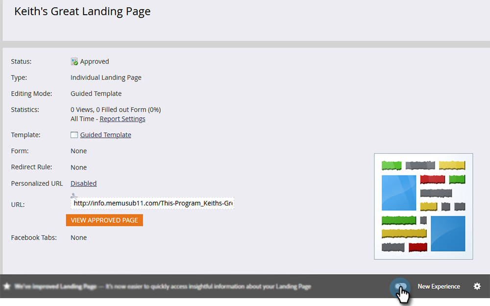

# Alternar Switch {#toggle-switch}

O Switch de alternância permite alternar entre a interface clássica do Marketo e a nova experiência de Marketo Engage de próxima geração. Está disponível na Exibição de lista da página inicial e nas páginas de detalhes do formulário.

>[!NOTE]
>
>Quando a opção Alternar switch estiver selecionada, todos os workflows existentes serão salvos automaticamente antes que a alteração da interface do usuário ocorra. Se uma operação já estiver em andamento (por exemplo: um ativo está em processo de aprovação), você receberá uma mensagem de erro indicando como tal e deverá tentar novamente após a conclusão da operação.

## Exibição de lista da página inicial {#landing-page-list-view}

No Marketo, selecione **Design Studio**.

Selecionar **Páginas de aterrissagem**.

Na parte inferior direita da página, clique no botão **Nova experiência** alternar.

A nova experiência será carregada.

>[!NOTE]
>
>A nova exibição de lista da Página inicial oferece filtros de pesquisa e a capacidade de executar ações de Página inicial em massa.

## Página Detalhes do Formulário {#form-details-page}

No Marketo, localize e selecione o formulário.

Na parte inferior direita da página, clique no botão **Nova experiência** alternar.

A nova experiência será carregada.

## Habilitar para todos os recursos {#enable-for-all-features}

Você tem a opção de ativar a interface da próxima geração do Marketo para todos os recursos disponíveis, atuais e futuros.

Em uma área que atualmente tem o Alternar Switch (neste exemplo, estamos em [Página Detalhes do Formulário](#form-details-page)), clique no ícone de engrenagem na parte inferior direita da página.

Selecionar **Habilitar para todos os recursos disponíveis** e clique em **OK**.

