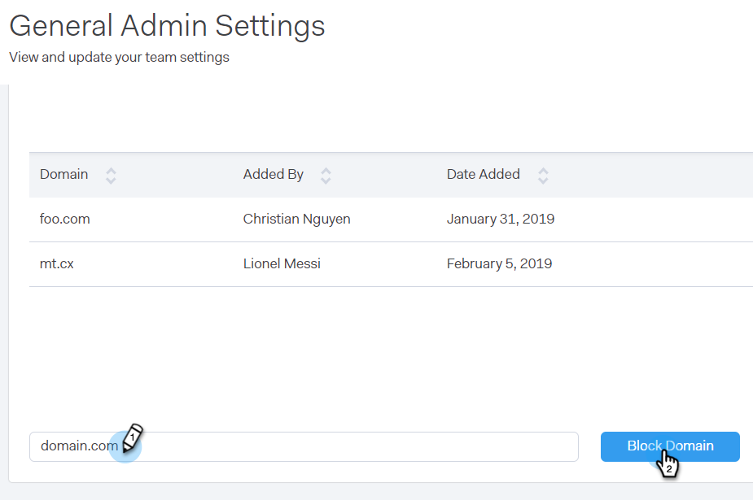

# Domínios bloqueados {#blocked-domains}

Ajude sua equipe de vendas a obter sucesso, evitando que ela envie emails acidentalmente de concorrentes, armadilhas de spam conhecidas ou qualquer outro domínio que você não deseja contatar.

>[!NOTE]
>
>**Permissões de administrador necessárias**

1. No aplicativo Web, clique no ícone de engrenagem e selecione **Configurações**.

   

1. Em Configurações de administração, clique em **Geral**.

   

1. Insira o domínio que deseja bloquear e clique em **Bloquear Domínio**.

   

   >[!NOTE]
   >
   >Emails que fazem parte de um [Email do grupo](/help/marketo/product-docs/marketo-sales-connect/email/using-the-compose-window/sending-emails-via-group-email.md) o envio que falhar devido ao ser enviado para um domínio de email bloqueado falhará silenciosamente e não será exibido na pasta de email com falha.
