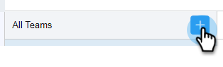

# Criar uma Subequipe {#create-a-sub-team}

## Criar uma Subequipe {#create-a-sub-team-1}

1. Clique no ícone de engrenagem e selecione **[!UICONTROL Configurações]**.

   

1. Em [!UICONTROL Configurações de Administração], selecione **[!UICONTROL Gerenciamento de Equipe]**.

   

1. Ao lado de [!UICONTROL Todas as Equipes], clique em **+**.

   

1. Insira um nome de equipe (e uma descrição opcional) e clique em **[!UICONTROL Criar]**.

   

   >[!NOTE]
   >
   >Agora você pode compartilhar modelos, campanhas e grupos com essa equipe.

## Adicionar Pessoas à sua Subequipe {#add-people-to-your-sub-team}

1. Ainda em [!UICONTROL Team Management], selecione o grupo **[!UICONTROL Todos]**.

   

1. Localize os usuários que você deseja adicionar à sua subequipe e marque as caixas de seleção.

   

1. Clique em **[!UICONTROL Adicionar seleção às equipes]**.

   

1. Clique no menu suspenso e selecione a(s) equipe(s) desejada(s).

   

1. Clique em **[!UICONTROL Adicionar às Equipes]** quando terminar.

   
