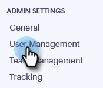

# Convidar membros da equipe {#invite-team-members}

Adicionar membros da equipe é rápido e fácil!

1. Clique no ícone de engrenagem e selecione **Settings**.

   

1. Em Configurações de administração, selecione **Gerenciamento de usuário**.

   

1. Clique em **Convidar usuários**.

   

1. Insira os endereços de email dos indivíduos que deseja adicionar e clique em **Next**.

   

   >[!NOTE]
   >
   >Por padrão, todos os novos membros serão adicionados à equipe Todos.

1. Clique em **OK**.

   
