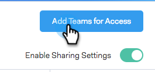

# Configurações de compartilhamento {#sharing-settings}

Gerencie melhor seus modelos restringindo o que os usuários podem compartilhar e com quais categorias.

Quando sua conta do Sales Connect é criada pela primeira vez, as Configurações de compartilhamento são ativadas. Isso dá aos administradores da sua conta a oportunidade de criar e organizar suas categorias de modelo antes de abrir as comportas e permitir que os usuários compartilhem conteúdo nas categorias da sua equipe.

Quando as Configurações de compartilhamento estiverem ativadas, somente administradores poderão compartilhar em categorias, a menos que sejam fornecidos privilégios de compartilhamento a uma equipe ou a todos. Com as Configurações de compartilhamento desativadas, não há restrições e todos os usuários podem compartilhar em qualquer categoria de modelo.

## Definir Suas Configurações De Compartilhamento {#configure-your-sharing-settings}

1. No [aplicativo Web](https://toutapp.com/login), vá para a página Configurações.

   

1. Em Configurações de Administração, selecione **Acesso de Compartilhamento**.

   

1. Verifique se as **Configurações de Compartilhamento** estão habilitadas. Isso significa que, por padrão, somente administradores poderão compartilhar modelos nas suas categorias.

   

1. Selecione a Categoria de modelo que deseja configurar.

   

1. Clique em **Adicionar equipes para acessar**.

   

1. Selecione as equipes que deseja adicionar.

   

   >[!NOTE]
   >
   >Se você não vir nenhuma equipe, precisará ir para o Gerenciamento de Equipe e criar uma equipe de usuários.

1. Clique em **Adicionar Equipes para Acesso** para salvar.

   

1. Agora que sua equipe foi adicionada, você pode optar por permitir que somente administradores de equipe compartilhem ou todos os usuários dessa equipe. Neste exemplo, demos acesso a todos os usuários na equipe de SDR que compartilhava.

   
