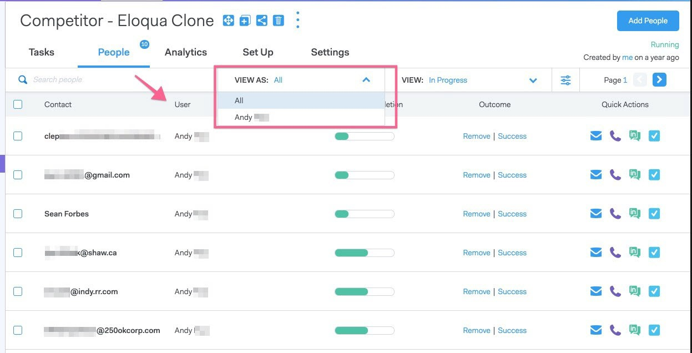

# Detalhes de acesso do usuário {#user-access-details}

A que Administradores e não Administradores têm acesso?

## Permissões de usuário administrador {#admin-user-permissions}

Os administradores podem [visualização todos os modelos](/help/marketo/product-docs/marketo-sales-connect/templates/view-template-list-as-a-another-user.md).

Os administradores podem [visualização todas as campanhas](/help/marketo/product-docs/marketo-sales-connect/campaigns/view-campaigns-list-as-another-user.md).

Os administradores podem visualização todas as atividades de e-mail.

Os administradores podem ver todas as pessoas em uma campanha em andamento.

Todos os registros de pessoas podem ser acessados no grupo Todos.

Os administradores podem parar as campanhas em nome dos usuários.

## Permissões de usuário não administrativo {#non-admin-user-permissions}

* Analytics:

   * Os usuários podem visualizar as análises de equipe
   * Os usuários podem detalhar somente as equipes às quais pertencem
   * Os usuários podem analisar suas próprias análises

* Página Relações:

   * Os usuários podem compartilhar grupos com todos
   * Os usuários podem compartilhar grupos apenas com as equipes às quais pertencem
   * Quando um usuário é excluído, seus contatos compartilhados transferem a propriedade para o administrador Principal que excluiu o usuário

* Batida de vendas - Próximo e ao vivo feed:

   * Os usuários podem visualização a visualização &quot;todos&quot;
   * Os usuários podem filtrar pelas equipes às quais pertencem
   * O usuário pode compartilhar publicações com todos
   * Os usuários podem compartilhar publicações somente com as equipes às quais pertencem

* Página Gerenciamento de equipe:

   * Não é possível visualização

* Página Modelos:

   * Os usuários podem compartilhar modelos com todos
   * Os usuários podem compartilhar modelos no categoria que seus administradores permitem
   * Quando um usuário é removido de um grupo, seus modelos não são compartilhados com esse grupo
   * Quando um usuário é excluído de um grupo, seus modelos transferem a propriedade para o administrador Principal que excluiu o usuário
