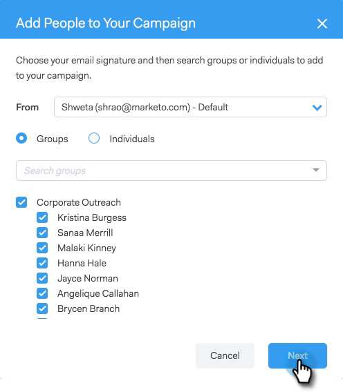

# Adicionar à campanha de marketing {#add-to-marketing-campaign}

>[!PREREQUISITES]
>
>[Tornar uma Campanha Visível para Usuários de Vendas](/help/marketo/product-docs/marketo-sales-connect/marketo/make-a-campaign-visible-to-sales-connect-users.md)

## Adicionar indivíduos a uma campanha {#add-individuals-to-a-campaign}

>[!NOTE]
>
>Para adicionar uma pessoa a uma Campanha do Marketo a partir de [!DNL Sales Connect], [!DNL Sales Connect] deve ter a ID de cliente em potencial do Marketo da pessoa.

1. Clique na guia **[!UICONTROL Pessoas]**.

   

1. Localize os contatos que deseja adicionar.

   

1. Clique na caixa de seleção para selecionar seus contatos.

   

1. Clique em **[!UICONTROL Adicionar seleção à campanha]**.

   

1. Como você está adicionando a uma campanha de marketing, pule a seleção de um endereço &quot;de&quot;. No entanto, você pode optar por adicionar mais contatos. Se desejar, clique em **[!UICONTROL Indivíduos]** e digite-os. Clique em **[!UICONTROL Avançar]** quando terminar.

   

1. Clique em **[!UICONTROL Campanha de marketing]**.

   

1. Clique no menu suspenso [!UICONTROL Espaços de trabalho] e escolha o espaço de trabalho que contém a campanha à qual você deseja adicionar o grupo.

   

   >[!NOTE]
   >
   >Se você não vir o espaço de trabalho desejado, verifique se o Administrador o provisiona por meio da página Acesso à equipe da Marketo.

1. Selecione a campanha desejada e clique em **[!UICONTROL Avançar]**.

   

1. Você verá os contatos que se qualificam. Clique em **[!UICONTROL Iniciar]** para adicioná-los.

   

## Adicionar um grupo a uma campanha {#add-a-group-to-a-campaign}

1. Clique na guia **[!UICONTROL Pessoas]**.

   

1. Em [!UICONTROL Meus grupos], selecione o grupo que deseja adicionar a uma campanha.

   

1. Clique em **[!UICONTROL Adicionar grupo à campanha]**.

   

1. Como você está adicionando a uma campanha de marketing, pule a seleção de um endereço &quot;de&quot;. No entanto, você pode optar por adicionar mais contatos. Se desejar, clique em **[!UICONTROL Indivíduos]** e digite-os. Clique em **[!UICONTROL Avançar]** quando terminar.

   

1. Selecione **[!UICONTROL Campanha de marketing]**.

   

   >[!NOTE]
   >
   >Para adicionar uma pessoa a uma Campanha do Marketo a partir de [!UICONTROL Sales Connect], o [!UICONTROL Sales Connect] deve ter a ID de cliente potencial do Marketo da pessoa.

1. Clique no menu suspenso **[!UICONTROL Espaços de trabalho]** e escolha o espaço de trabalho que contém a campanha à qual você deseja adicionar o grupo.

   

   >[!NOTE]
   >
   >Se você não vir o espaço de trabalho desejado, verifique se o Administrador o provisiona por meio da página Acesso à equipe da Marketo.

1. Selecione a campanha desejada e clique em **[!UICONTROL Avançar]**.

   

1. Você verá os contatos que se qualificam. Clique em **[!UICONTROL Iniciar]** para adicioná-los.

   
