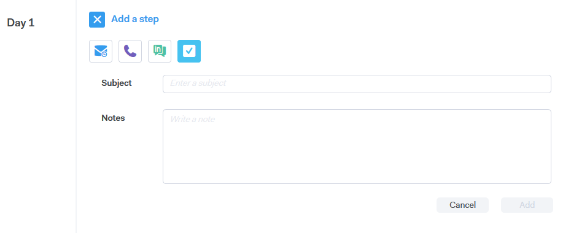

# Tipos de etapa da campanha {#campaign-step-types}

Ao adicionar uma etapa à sua campanha, você tem quatro opções.

## Email {#email}

Redija um novo email ou use um modelo preexistente.

| **Usar um Modelo** | Selecione um dos modelos pré-existentes |
|---|---|
| **Salvar como Modelo** | Salve o email que acabou de compor como um novo modelo |
| **Adicionar conteúdo** | Faça upload de um arquivo no nosso servidor e receba um URL (apontando para o conteúdo) que possa ser rastreado no seu email |
| **Anexar Arquivos** | Anexar um arquivo do seu computador ao email (limite de tamanho de 23 MB) |

>[!TIP]
>
>Saiba mais sobre as [opções de envio](/help/marketo/product-docs/marketo-sales-connect/campaigns/understanding-send-options.md).

## Chamada {#call}

Defina um lembrete para acompanhar um contato por telefone. Você também pode salvar anotações para serem usadas como um talk track durante a chamada.

## InMail {#inmail}

Acompanhar em vários canais é uma ótima maneira de se conectar com clientes potenciais. Com tarefas InMail, você pode configurar um lembrete para entrar em contato via [!DNL LinkedIn].

## Tarefa personalizada {#custom-task}

Utilize tarefas personalizadas quando as opções acima não forem aplicáveis. Por exemplo, você pode convidar um colega para acompanhar um cliente potencial por email.

