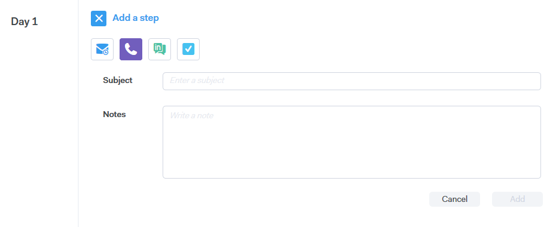

# Tipos de etapas de campanha {#campaign-step-types}

Ao adicionar uma etapa à sua campanha, você tem quatro opções.

## Email {#email}

Componha um novo email ou use um modelo pré-existente.

| **Usar um modelo** | Selecione um dos modelos preexistentes |
|---|---|
| **Salvar como modelo** | Salve o email que você acabou de compor como um novo modelo |
| **Adicionar conteúdo** | Carregue um arquivo em nosso servidor e receba um URL (apontando para o conteúdo) que possa ser rastreado em seu email |
| **Anexar arquivos** | Anexar um arquivo de seu computador ao email (limite de tamanho de 23 MB) |

>[!TIP]
>
>Saiba mais detalhes sobre suas opções [de](http://docs.marketo.com/x/7QDb)envio.

## Chamada {#call}

Configure um lembrete para acompanhar um contato via telefone. Você também pode salvar notas para serem usadas como um rastreamento de fala durante a chamada.

## InMail {#inmail}

O acompanhamento de vários canais é uma excelente maneira de se conectar com clientes potenciais. Com o InMail tarefa, você pode configurar um lembrete para entrar em contato com o LinkedIn.

## Tarefa personalizada {#custom-task}

Utilize tarefas personalizadas quando as opções acima não forem aplicáveis. Por exemplo, você pode convidar um colega para acompanhar um cliente potencial por email.

