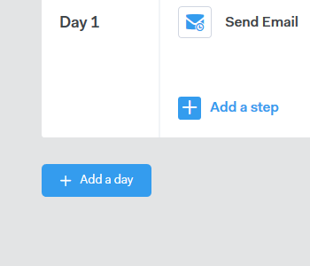

# Criar uma campanha {#create-a-campaign}

Campanhas são uma série de etapas com vários canais que incluem: emails, chamadas telefônicas, InMail e tarefas personalizadas. Eles permitem que você simplifique suas comunicações com seus clientes potenciais e existentes.

Com Campanhas é possível:

* **Organizar**: simplifique todas as suas atividades de alcance geral em um único local para uma execução eficiente.

* **Escala**: agende todos os seus esforços de divulgação para poder dimensionar seus esforços, minimizar o trabalho manual e personalizar o quanto for necessário.
* **Medida**: controle o sucesso de todos os seus emails e tarefas em um único local enquanto faz o logon automático no [!DNL Salesforce]. Ao conhecer o que está repercutindo e levando a resultados, você pode testar e melhorar seus resultados de forma consistente.

Então, como você configura uma campanha?

1. Clique na guia **[!UICONTROL Campanhas]**.

   

1. Selecione uma categoria e clique no botão **[!UICONTROL Criar nova campanha]** para criar uma nova campanha.

   

   >[!NOTE]
   >
   >Crie uma nova categoria clicando em **+** ao lado de **[!UICONTROL Categorias]**.

1. A categoria escolhida será selecionada. Se mudar de ideia, clique no menu suspenso e selecione um diferente. Quando terminar, clique em **[!UICONTROL Continuar]**.

   

1. Clique em **[!UICONTROL Adicionar uma etapa]**.

   

1. Escolha entre: Email, Chamada, InMail ou Tarefa personalizada. Neste exemplo, estamos escolhendo [Email](/help/marketo/product-docs/marketo-sales-connect/campaigns/campaign-step-types.md#email).

   

1. Depois de criar seu primeiro dia e etapa, o botão &quot;[!UICONTROL Adicionar um dia]&quot; é ativado e você pode adicionar quantos dias e etapas forem necessários para seu processo de vendas.

   

   >[!NOTE]
   >
   >&quot;Dias&quot; não é o número de dias entre ações, mas o dia dentro da sequência. Por exemplo, se sua campanha vai durar 7 dias, inserir &#39;3&#39; significa que a ação será executada no dia 3 de 7, **não** 3 dias depois.

1. Certifique-se de personalizar o agendamento e as opções de resposta, como ignorar fins de semana (o que é ótimo), visitando a **[!UICONTROL Guia Configurações]** da sua campanha.

   

   Agora é hora de começar a adicionar pessoas à sua campanha!
