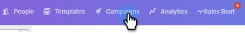

# Criar uma Campanha {#create-a-campaign}

O Campanha é uma série de etapas de vários canais, incluindo: e-mails, chamadas telefônicas, InMail e tarefas personalizadas. Eles permitem que você dinamize suas comunicações com seus clientes atuais e potenciais.

Com o Campanha você pode:

* **Organizar**: Simplifique todas as atividades de alcance em um único lugar para uma execução eficiente.

* **Escala**: Agende todos os seus esforços de alcance para ampliar seus esforços, minimizar o trabalho manual e personalizar o máximo que precisar.
* **Medida**: Rastreie o sucesso de todos os seus e-mails e tarefas em um único lugar enquanto os faz logon automaticamente no Salesforce. Ao saber o que está ressoando e levando a resultados, você pode testar e melhorar seus resultados de forma consistente.

Então, como montar uma Campanha?

1. Clique na guia **Campanha**.

   

1. Selecione uma categoria e clique no botão **Criar uma Campanha** para criar uma nova Campanha.

   

   >[!NOTE]
   >
   >Crie uma nova categoria clicando em** +** ao lado de **Categoria**.

1. A categoria escolhida será selecionada. Se você mudar de ideia, clique na lista suspensa e selecione uma diferente. Quando terminar, clique em **Continuar**.

   

1. Clique em **Adicionar uma Etapa**.

   

1. Escolha entre: Email, Chamada, InMail ou Tarefa personalizada. Neste exemplo, estamos escolhendo [Email](http://docs.marketo.com/display/DOCS/Campaign+Step+Types#CampaignStepTypes-Email).

   

1. Depois de criar seu primeiro dia e etapa, o botão &quot;Adicionar um dia&quot; é ativado e você pode adicionar quantos dias e etapas forem necessários para o processo de vendas.

   

   >[!NOTE]
   >
   >&quot;Dias&quot; não é o número de dias entre ações, mas o dia dentro da sequência. Por exemplo, se sua campanha durar 7 dias, inserir &#39;3&#39; significa que a ação será executada no dia 3 de 7, **não **3 dias depois.

1. Certifique-se de personalizar as opções de agendamento e resposta, como ignorar fins de semana (o que é incrível) visitando a **guia Configurações** para sua Campanha.

   

   Agora é hora de start para adicionar pessoas à sua Campanha!

