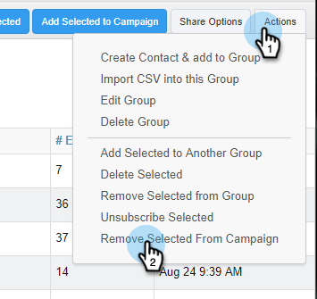

# Remover pessoas de uma campanha {#remove-people-from-a-campaign}

Você pode encerrar uma campanha automaticamente quando um recipient responder. Além disso, você pode optar por marcar a Campanha como um &quot;sucesso&quot; para esse recipient.

Para configurar isso, após criar sua campanha, marque as caixas [!UICONTROL Cancelar inscrição] na parte [!UICONTROL Configurações] da guia [!UICONTROL Campanhas]. Ambas as opções encerrarão a campanha e seu recipient não receberá mais emails de você. Você deve ter um rastreamento de resposta para que isso funcione.

Além disso, você pode remover pessoas da própria campanha, remover pessoas de uma campanha na página Pessoas e remover um grupo inteiro de pessoas. Vamos observar os três métodos abaixo.

## Remover uma pessoa diretamente de uma campanha {#remove-a-person-directly-from-a-campaign}

1. Em [!DNL Sales Connect], clique na guia **[!UICONTROL Campanhas]**.

   

1. Encontre sua campanha e selecione-a.

   

1. Sua campanha aparece à direita. Clique em qualquer lugar para abri-lo.

   

1. Localize a pessoa que você deseja remover e clique em **[!UICONTROL Remover]**.

   

1. (ETAPA OPCIONAL) Você também pode remover várias pessoas de uma só vez clicando nas caixas de seleção ao lado de seus nomes e clicando no botão **[!UICONTROL Remover]** na parte superior.

   

## Remover uma pessoa de uma campanha na página Pessoas {#remove-a-person-from-a-campaign-within-the-people-page}

1. Em [!DNL Sales Connect], clique na guia **[!UICONTROL Pessoas]**.

   

1. Localize e selecione a pessoa que deseja remover.

   

1. O painel Exibição de detalhes da pessoa é aberto à direita. Clique na guia **[!UICONTROL Histórico]** seguida pelo botão **[!UICONTROL Remover]**.

   

## Remover um grupo de pessoas de uma campanha {#remove-a-group-of-people-from-a-campaign}

1. Em [!DNL Sales Connect], clique na guia **[!UICONTROL Pessoas]**.

   

1. Localize e selecione seu grupo em **[!UICONTROL Meus grupos]**.

   

1. Selecione as pessoas que você deseja remover.

   

1. Clique em **[!UICONTROL Ações]** e escolha **[!UICONTROL Remover seleção da campanha]**.

   
