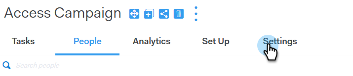

# Ignorar fins de semana {#skip-weekends}

Ao automatizar uma campanha, você provavelmente não quer que seus emails sejam enviados em um sábado ou domingo. Caso contrário, você poderá ignorar os finais de semana.

1. Em [!DNL Sales Connect], clique na guia **[!UICONTROL Campanhas]**.

   

1. Localize e selecione sua campanha.

   

1. Clique em **[!UICONTROL Configurações]**.

   

1. Marque a caixa de seleção **[!UICONTROL Ignorar fins de semana]**.

   

   >[!NOTE]
   >
   >Sem pular fins de semana, seus emails são agendados com base em uma semana normal de 7 dias.
