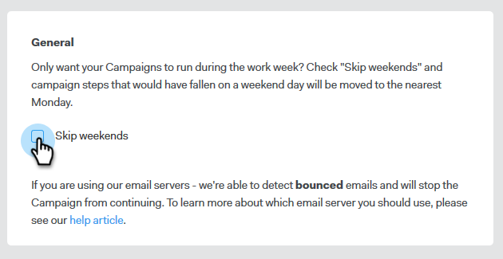

# Ignorar Fim de Semana {#skip-weekends}

Ao automatizar uma campanha, você provavelmente não quer que seus emails sejam enviados em um sábado ou domingo. Caso contrário, você poderá ignorar os fins de semana.

1. No Sales Connect, clique no link **Campanhas** guia .

   

1. Localize e selecione sua campanha.

   

1. Clique em **Configurações**.

   

1. Selecione o **Ignorar Fim de Semana** caixa de seleção.

   

   >[!NOTE]
   >
   >Sem ignorar os fins de semana, seus emails são agendados com base em uma semana regular de 7 dias.
