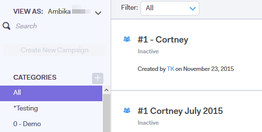

# Exibir a lista de campanhas como outro usuário {#view-campaigns-list-as-another-user}

Como administrador, você pode visualizar campanhas como qualquer usuário.

>[!NOTE]
>
>**Permissões de administrador são necessárias**

1. No aplicativo Web, clique em **[!UICONTROL Campanhas]**.

   

1. Clique no menu suspenso **[!UICONTROL Exibir como]** e selecione o usuário desejado.

   

1. Agora você está visualizando campanhas como o usuário selecionado.

   

   >[!NOTE]
   >
   >Você também pode usar filtros ou a função de pesquisa junto com Exibir como para exibir o que é mais relevante para você.
