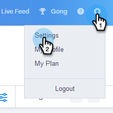

# Como instalar personalizações na sandbox do Salesforce {#how-to-install-customizations-in-your-salesforce-sandbox}

>[!NOTE]
>
>**Permissões de administrador são necessárias**

>[!PREREQUISITES]
>
>[Conectar Vendas e Conectar-se à Sandbox da Salesforce](/help/marketo/product-docs/marketo-sales-connect/crm/salesforce-customization/how-to-connect-sales-connect-to-your-salesforce-sandbox.md)

1. Em [!DNL Sales Connect], clique no ícone de engrenagem no canto superior direito e selecione **[!UICONTROL Configurações]**.

   

1. Em [!UICONTROL Configurações de Administração], clique em **[!UICONTROL Salesforce]**.

   

1. Clique em **[!UICONTROL Instalar personalizações]**.

   

   Em seguida, siga as etapas de instalação da personalização como você faria em uma conta comum do [!DNL Salesforce].
