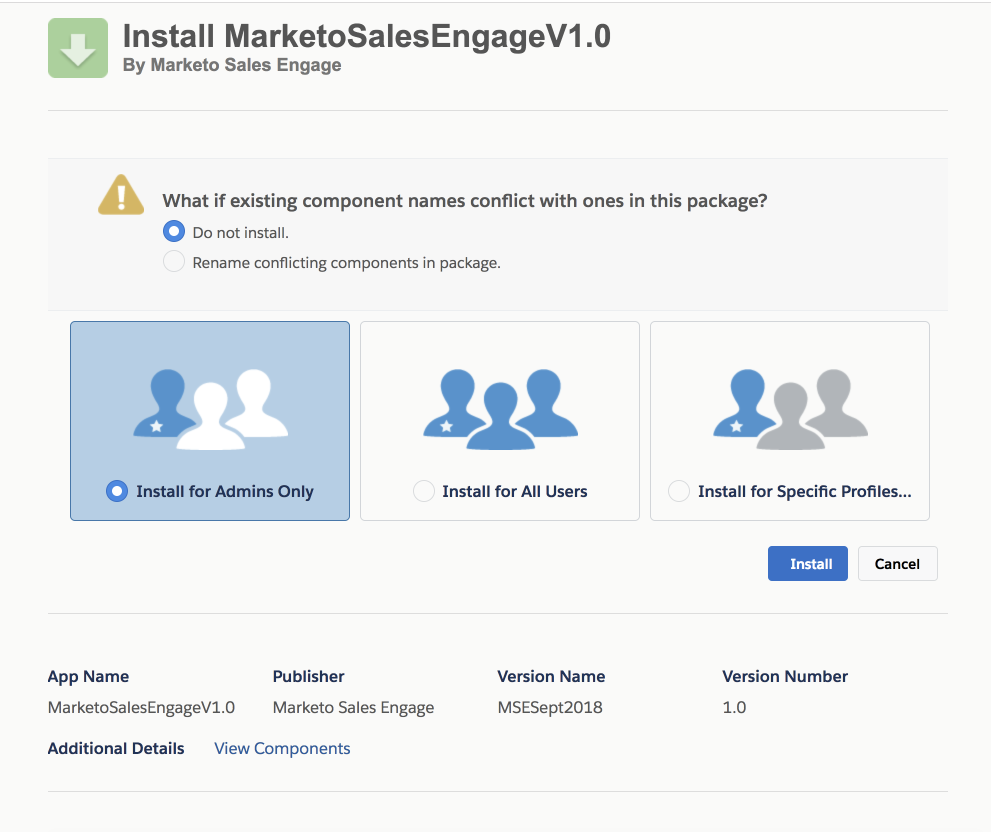

# Instalar a Personalização do [!DNL Salesforce] para Clientes da Professional Edition {#install-salesforce-customization-for-professional-edition-customers}

Os clientes com o [!DNL Salesforce] Professional Edition terão que seguir essas etapas para instalar a personalização.

>[!PREREQUISITES]
>
>* O administrador [!DNL Sales Connect] precisa conectar suas contas [!DNL Salesforce] e [!DNL Sales Connect].
>* A instância [!DNL Salesforce] usada precisa de espaço para instalar treze Campos de Atividade Personalizados.

## Instalação {#installation}

1. Em [!DNL Sales Connect], clique no ícone de engrenagem no canto superior direito e selecione **[!UICONTROL Configurações]**.

   

1. Em [!UICONTROL Configurações de Administração], clique em **[!UICONTROL Salesforce]**.

   

1. Verifique se você está conectado à sua conta do [!DNL Salesforce].

   >[!CAUTION]
   >
   >Se estiver conectado, você verá um botão verde &quot;[!UICONTROL Instalar]&quot;. **NÃO** clique neste botão; em vez disso, vá para a etapa 4.

1. Faça logon na conta do [!DNL Salesforce] à qual você está conectado e clique em [neste link](https://login.salesforce.com/packaging/installPackage.apexp?p0=04t0b000001oWEZ).
1. Você será enviado para a página de Instalação [!DNL Sales Connect].

   

1. Escolha os usuários para os quais deseja instalar personalizações: somente administrador, todos os usuários ou perfis específicos.
1. Clique no botão **[!UICONTROL Instalar]** para instalar a personalização.
1. Para confirmar a instalação bem-sucedida, faça logon em sua conta do [!DNL Salesforce].
1. Clique em **[!UICONTROL Instalação]**, procure por &quot;Pacotes Instalados&quot; na barra de pesquisa e clique em **[!UICONTROL Pacotes Instalados]**.

   Você verá as Personalizações do Marketo Sales Connect aqui.

   Para configurar o [!DNL Sales Connect] na sua instância do [!DNL Salesforce], siga as etapas da seção &quot;CONFIGURANDO O PACOTE DO SALES ENGAGE SALESFORCE&quot; na página 7 do Guia de Instalação.

   >[!NOTE]
   >
   >[!DNL Sales Engage] é o nome anterior de [!DNL Sales Connect].

## Guias {#guides}

[Guia de Instalação do Salesforce Classic](https://s3.amazonaws.com/tout-user-store/salesforce/assets/Marketo+Sales+Engage+For+Salesforce_+Installation+and+Success+Guide.pdf)

[Guia de Instalação do Salesforce Lightning](https://s3.amazonaws.com/tout-user-store/salesforce/assets/SF+Guide+for+Lightning.pdf)
