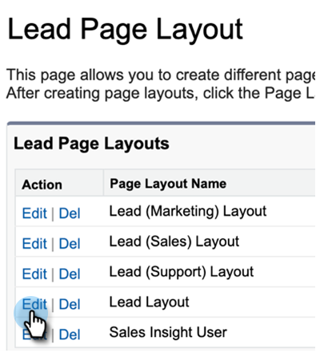
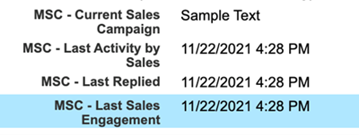

# Desinstale o Marketo Sales Connect do Salesforce Classic {#uninstall-marketo-sales-connect-from-salesforce-classic}

Veja como desinstalar o pacote Marketo Sales Connect da sua conta do Salesforce depois de começar a usar as ações do Sales Insight.

## Remover campos de Conexão de Vendas do Layout da Página {#remove-sales-connect-fields-from-page-layout}

1. No Salesforce Classic, clique em **Configurar**.

   

1. Na navegação à esquerda, em Criar, expanda (mas não clique em) Personalizar e, em seguida, em Clientes potenciais. Em seguida, selecione **Layouts de página**.

   

1. Clique em **Editar** ao lado de Layout do cliente potencial.

   

1. No console, selecione **Campos**. Na Localização Rápida, pesquise &quot;MSC&quot;. Todos os campos acinzentados foram adicionados ao layout da página. Você terá que excluí-los.

   

   >[!NOTE]
   >
   >Se nenhum dos campos estiver esmaecido, significa que você não os adicionou ao layout da página. Você pode ignorar esta seção.

1. Role até a seção que tem seus Campos personalizados de conexão de vendas.

   

1. Há 10 tipos de campos MSC que podem ser adicionados a esta seção. Remova todos os campos adicionados ou simplesmente exclua a seção inteira.

1. Clique em **Salvar rapidamente** quando terminar.

   

## Remover botões de conexão de vendas dos layouts de página {#remove-sales-connect-buttons-from-page-layouts}

1. No console (Etapa 4 acima), selecione **Botões**. Pesquise &quot;MSC.&quot; Todos os botões acinzentados foram adicionados à seção de botão personalizada. Você terá que excluí-los.

   

   >[!NOTE]
   >
   >Se nenhum dos botões estiver acinzentado, significa que você não os adicionou. Você pode ignorar esta seção.

1. Arraste e solte os botões MSC da seção Botões personalizados para o console.

   

1. Clique em **Salvar rapidamente** quando terminar.

   

## Remover Campos de Conexão de Vendas da Seção Histórico de Atividades {#remove-sales-connect-fields-from-activity-history-section}

1. Role para a parte inferior da página até a seção da lista relacionada ao Histórico de atividades e clique no ícone da Chave inglesa.

   

1. Selecione os Campos de Conexão de Vendas na área Campos Selecionados e clique na seta Remover. Clique em **OK** quando terminar.

   

   >[!NOTE]
   >
   >A abreviação MSE _is_ Sales Connect. É apenas o nome anterior, &quot;Marketo Sales Engage&quot;.

1. Clique em **Salvar** quando terminar de usar a página de clientes potenciais.

## Remover os Botões de Ação em Massa da Conexão de Vendas da Exibição da Lista de Clientes Potenciais {#remove-sales-connect-bulk-action-buttons-from-lead-list-view}

1. Na navegação à esquerda, em Criar, expanda (mas não clique em) Personalizar e, em seguida, em Clientes potenciais. Em seguida, selecione **Pesquisar Layouts**.

   

1. Ao lado de Exibição da Lista de Clientes Potenciais, clique em **Editar**.

   

1. Selecione **Adicionar ao MSC Campaign (Classic)**, **Email com MSC (Classic)** e **Enviar para o MSC (Classic)** e clique na seta Remover. Depois clique em **Salvar**.

   

Você não deve mais ver os botões na exibição da lista de clientes potenciais.

## Remover Configuração MSC para Contatos {#remove-msc-configuration-for-contacts}

1. No Salesforce, clique em **Configurar**.

1. Na navegação à esquerda, em Criar, expanda (mas não clique em) Personalizar e, em seguida, em Contatos. Em seguida, selecione **Layouts de página**.

1. Ao lado do Layout do Contato, clique em **Editar**.

1. Repita as etapas das três seções.

## Remover Configuração MSC para Oportunidade {#remove-msc-configuration-for-opportunity}

1. No Salesforce, clique em **Configurar**.

1. Na navegação à esquerda, em Criar, expanda (mas não clique em) Personalizar e, em seguida, em Oportunidades. Em seguida, selecione **Layouts de página**.

1. Ao lado de Layout da oportunidade, clique em **Editar**.

1. Repita as etapas das três seções.

A visualização da oportunidade tem apenas um botão - &quot;Enviar email MSE&quot; e os seguintes campos:

## Remover Configuração do MSC para a Conta {#remove-msc-configuration-for-account}

1. No Salesforce, clique em **Configurar**.

1. Na navegação à esquerda, em Criar, expanda (mas não clique em) Personalizar e, em seguida, em Conta. Em seguida, selecione **Layouts de página**.

1. Ao lado de Layout da conta, clique em **Editar**.

1. Repita as etapas das três seções.

A exibição Conta tem apenas um botão - &quot;Enviar email do MSE&quot; e os seguintes campos:

## Remover Caixa de Saída de Vendas do Marketo {#remove-marketo-sales-outbox}

1. No Salesforce, clique na guia **+** na parte superior da tela.

1. Clique em **Personalizar minhas guias**.

1. Selecione a opção Caixa de Saída de Vendas do Marketo à direita. Clique na seta Remover e em **Salvar**.

## Excluir Pacote de Conexão de Vendas {#delete-sales-connect-package}

Depois de remover todos os objetos da sua conta do Salesforce, siga as etapas abaixo.

1. No Salesforce, clique em **Configurar**.

1. Na caixa Localização Rápida, informe &quot;Classes de Apex&quot;.

1. Clique em **Excluir** ao lado de todas as entradas &quot;MarketoSalesConnectionCustomization&quot; ou &quot;MarketoSalesEngageCustomization&quot; na sua lista.

Pronto!

Veja a seguir uma lista de todos os objetos que precisam ser removidos da sua instância do Salesforce:

## Detalhes de Personalização do Sales Connect {#sales-connect-customization-details}

<table>
 <tr>
  <th>Campos de atividades personalizadas</th>
  <th>Descrição</th>
  <th>Tipo</th>
  <th>Tipo de dados</th>
 </tr>
 <tr>
  <td>ID de Presença Local da Chamada MSC</td>
  <td>Como usuário, posso escolher Presença Local como uma opção quando faço chamadas do Telefone MSC. As chamadas recebidas mostrarão um número local para o receptor</td>
  <td>Atividade</td>
  <td>Texto</td>
 </tr>
 <tr>
  <td>URL de Gravação de Chamada MSC</td>
  <td>As chamadas podem ser gravadas e um link para a gravação será registrado aqui </td>
  <td>Atividade</td>
  <td>Texto</td>
 </tr>
 <tr>
  <td>Campanha MSC</td>
  <td>Registra o nome da campanha do MSC em que o contato/lead está</td>
  <td>Atividade</td>
  <td>Texto</td>
 </tr>
 <tr>
  <td>URL da campanha MSC</td>
  <td>Registra o URL da campanha criada no MSC. Clicar nisso abrirá a campanha no aplicativo Web do MSC</td>
  <td>Atividade</td>
  <td>Texto</td>
 </tr>
 <tr>
  <td>Etapa atual da campanha do MSC</td>
  <td>Se um contato/lead estiver em uma campanha, esse campo registrará o nome da etapa em que ele está no momento</td>
  <td>Atividade</td>
  <td>Caixa de seleção</td>
 </tr>
 <tr>
  <td>Anexo de email do MSC visualizado</td>
  <td>Registra dados quando um email é enviado com um anexo que é visualizado pelo destinatário</td>
  <td>Atividade</td>
  <td>Caixa de seleção</td>
 </tr>
 <tr>
  <td>Email MSC Clicado</td>
  <td>Registra uma marca de seleção quando o destinatário clicar em um link no email</td>
  <td>Atividade</td>
  <td>Caixa de seleção</td>
 </tr>
 <tr>
  <td>Email MSC Respondido</td>
  <td>Registra uma marca de seleção quando o destinatário responde ao email</td>
  <td>Atividade</td>
  <td>Texto</td>
 </tr>
 <tr>
  <td>Status do Email MSC</td>
  <td>Mostra se um email foi enviado/está em andamento/foi rejeitado (o rastreamento dos emails devolvidos depende do canal de entrega usado)</td>
  <td>Atividade</td>
  <td>Texto</td>
 </tr>
 <tr>
  <td>Modelo de e-mail MSC</td>
  <td>Registra o nome do modelo MSC que foi usado no email enviado ao cliente potencial/contato</td>
  <td>Atividade</td>
  <td>Texto</td>
 </tr>
 <tr>
  <td>URL do Modelo de email do MSC</td>
  <td>Registra o URL do modelo criado no MSC. Clicar nisso abrirá o modelo no aplicativo Web do MSC</td>
  <td>Atividade</td>
  <td>Texto</td>
 </tr>
 <tr>
  <td>URL de email do MSC</td>
  <td>Clicar nesse URL abrirá a central de comando no MSC e puxará a guia de histórico Exibição de detalhes do usuário, onde o usuário poderá ver o email enviado</td>
  <td>Atividade</td>
  <td>Texto</td>
 </tr>
 <tr>
  <td>Email do MSC Exibido</td>
  <td>Registra uma marca de seleção quando o destinatário exibe um email</td>
  <td>Atividade</td>
  <td>Caixa de seleção</td>
 </tr>
</table>

<table>
 <tr>
  <th>Campo de Log de Rollup do MSC</th>
  <th>Descrição</th>
  <th>Tipo</th>
  <th>Tipo de dados</th>
 </tr>
 <tr>
  <td>MSC - Último engajamento de marketing</td>
  <td>Último envolvimento recebido de Marketing</td>
  <td>
  
Conta 
  
Contato 
  
Lead 
  
Oportunidade</td>
  <td>Data e hora</td>
 </tr>
 <tr>
  <td>MSC - Última data de compromisso de marketing</td>
  <td>Carimbo de data e hora do envolvimento do Marketing</td>
  <td>
  
Conta 
  
Contato 
  
Lead 
  
Oportunidade</td>
  <td>Data e hora</td>
 </tr>
 <tr>
  <td>MSC - Última descrição do compromisso de marketing</td>
  <td>Descrição do compromisso</td>
  <td>
  
Conta 
  
Contato 
  
Lead 
  
Oportunidade</td>
  <td>Texto</td>
 </tr>
 <tr>
  <td>MSC - Último envolvimento de marketing Source</td>
  <td>Source do engajamento de marketing</td>
  <td>
  
Conta 
  
Contato 
  
Lead 
  
Oportunidade</td>
  <td>Texto</td>
 </tr>
 <tr>
  <td>MSC - Último Tipo de Compromisso de Marketing</td>
  <td>Tipo de envolvimento (por exemplo: atividade da Web)</td>
  <td>
  
Conta 
  
Contato 
  
Lead 
  
Oportunidade</td>
  <td>Texto</td>
 </tr>
 <tr>
  <td>MSC - Última Atividade por Vendas</td>
  <td>Última atividade de saída executada pela equipe de vendas</td>
  <td>
  
Conta 
  
Contato 
  
Lead 
  
Oportunidade</td>
  <td>Data e hora</td>
 </tr>
 <tr>
  <td>MSC - Última Resposta</td>
  <td>Última resposta de email para Email de vendas</td>
  <td>
  
Conta 
  
Contato 
  
Lead 
  
Oportunidade</td>
  <td>Data e hora</td>
 </tr>
 <tr>
  <td>MSC - Campanha de vendas atual</td>
  <td>Registra o nome da campanha do MSC em que o contato/lead está</td>
  <td>
  
Conta 
  
Contato 
  
Lead 
  
Oportunidade</td>
  <td>Texto</td>
 </tr>
 <tr>
  <td>MSC - Último contrato de vendas</td>
  <td>Último envolvimento recebido de Vendas</td>
  <td>
  
Conta 
  
Contato 
  
Lead 
  
Oportunidade</td>
  <td>Data e hora</td>
 </tr>
 <tr>
  <td>MSC - Recusa</td>
  <td>Campo de recusa</td>
  <td>
  
Conta 
  
Contato 
  
Lead 
  
Oportunidade</td>
  <td>Caixa de seleção</td>
 </tr>
</table>

<table>
 <tr>
  <th>Botões MSC</th>
  <th>Descrição</th>
  <th>Tipo</th>
 </tr>
 <tr>
  <td>Enviar Email MSC</td>
  <td>Enviar emails de vendas do Salesforce</td>
  <td>
  
Conta 
  
Contato 
  
Lead 
  
Oportunidade</td>
 </tr>
 <tr>
  <td>Adicionar à campanha MSC</td>
  <td>Adicionar às campanhas de MSC do Salesforce</td>
  <td>
  
Contato
  
Lead</td>
 </tr>
 <tr>
  <td>Enviar para MSC</td>
  <td>Contato por push do Salesforce para o MSC</td>
  <td>
  
Contato
  
Lead</td>
 </tr>
 <tr>
  <td>Chamada com MSC</td>
  <td>Fazer chamadas de vendas do Salesforce</td>
  <td>
  
Contato
  
Lead</td>
 </tr>
</table>

<table>
 <tr>
  <th>Botões de Ação em Massa do MSC</th>
  <th>Descrição</th>
  <th>Tipo</th>
 </tr>
 <tr>
  <td>Adicionar ao MSC Campaign (Classic)</td>
  <td>Adicionar às campanhas de MSC do Salesforce</td>
  <td>
  
Contato
  
Lead</td>
 </tr>
 <tr>
  <td>Enviar para MSC (Clássico)</td>
  <td>Contato por push do Salesforce para o MSC</td>
  <td>
  
Contato
  
Lead</td>
 </tr>
 <tr>
  <td>Email com MSC (Clássico)</td>
  <td>Email com MSC do Salesforce</td>
  <td>
  
Contato
  
Lead</td>
 </tr>
</table>
