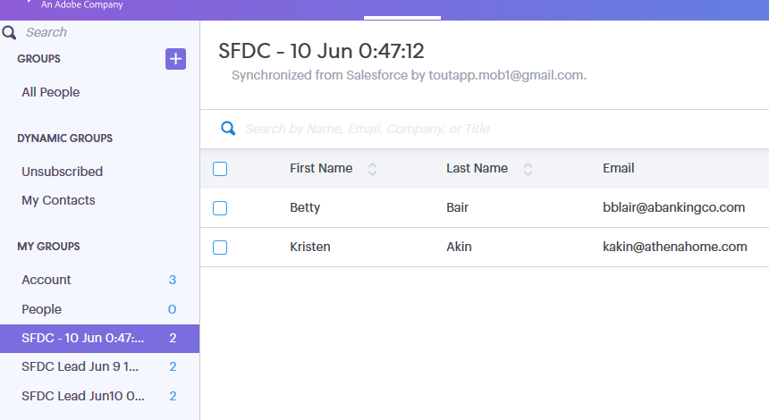

# Uso de ações em massa no Salesforce Classic {#using-bulk-actions-in-salesforce-classic}

Saiba como executar ações em massa, como adicionar leads a uma campanha, enviar um email em massa ou enviar leads do Salesforce para o Sales Connect.

>[!PREREQUISITES]
>
>Atualize para a versão mais recente do pacote Sales Connect e instale os botões de ação em massa na visualização lead/contato. [Clique aqui para obter instruções](https://s3.amazonaws.com/tout-user-store/salesforce/assets/Marketo+Sales+Engage+For+Salesforce_+Installation+and+Success+Guide.pdf).

>[!NOTE]
>
>Antes de seguir as etapas descritas, verifique se você está conectado à conta do Marketo Sales Connect.

## Email em massa {#bulk-email}

1. No Salesforce, clique no botão **Clientes potenciais** , em seguida, a **Ir** botão.

   

1. Escolha os leads desejados e clique na guia **E-mail com MSC (Classic)** botão.

   

1. Um e-mail da MSC aparecerá. Ele inclui os seguintes recursos:

   a. O campo &quot;Para&quot; mostra &quot;Todos os recebimentos&quot; - corresponde à lista de leads que você escolheu na Exibição da Lista de Lead\
   b. Essa lista é visível no painel esquerdo chamado &quot;Composição em massa&quot; - você pode adicionar/remover destinatários aqui\
   c. Você pode escolher um modelo ou criar seu próprio email\
   d. Você pode visualizar campos dinâmicos que serão preenchidos no seu email\
   e. Você pode enviar o email imediatamente ou agendar o envio posteriormente

   

## Adicionar à campanha  {#add-to-campaign}

1. No Salesforce, clique no botão **Clientes potenciais** , em seguida, a **Ir** botão.

   

1. Escolha os leads desejados e clique na guia **Adicionar à Campanha MSC (Clássica)** botão.

   

1. Um pop-up &quot;Adicionar pessoas à sua campanha&quot; será exibido. Clique em **Próximo** e percorra o fluxo de campanha típico para acionar uma campanha MSC.

   

## Enviar por push ao Marketo Sales Connect {#push-to-marketo-sales-connect}

1. No Salesforce, clique no botão **Clientes potenciais** , em seguida, a **Ir** botão.

   

1. Escolha os leads desejados e clique na guia **Encaminhar para MSC (Clássico)** botão.

   

1. Uma nova guia chamada &quot;Salesforce Bridge&quot; será aberta. Clique no botão **Prossiga para o Grupo →** botão.

   

1. Você será enviado para sua conta do MSC onde verá um grupo criado com carimbo de data/hora. Você receberá uma notificação quando a sincronização for concluída e o grupo incluirá os leads sincronizados do Salesforce.

   

>[!NOTE]
>
>Você também pode seguir as mesmas etapas para usar ações em massa na Exibição de lista de contatos.

>[!MORELIKETHIS]
>
>* [Enviar emails por email de grupo](/help/marketo/product-docs/marketo-sales-connect/email/using-the-compose-window/sending-emails-via-group-email.md)
>* [Composição de emails em massa com Selecionar e enviar](/help/marketo/product-docs/marketo-sales-connect/email/using-the-compose-window/composing-bulk-emails-with-select-and-send.md#sending-emails)

