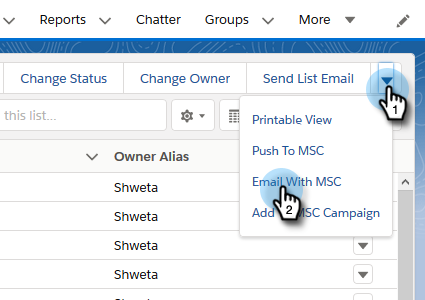

# Uso de ações em massa no Salesforce Lightning {#using-bulk-actions-in-salesforce-lightning}

Saiba como executar ações em massa, como adicionar clientes potenciais a uma campanha, enviar um email em massa ou enviar clientes potenciais do Salesforce para o Sales Connect.

>[!PREREQUISITES]
>
>Atualize para a versão mais recente do pacote do Sales Connect e instale os botões de ação em massa na sua visualização de cliente potencial/contato. [Clique aqui para obter instruções](http://s3.amazonaws.com/tout-user-store/salesforce/assets/SF+Guide+for+Lightning.pdf).

>[!NOTE]
>
>Antes de seguir as etapas abaixo, verifique se você está conectado à sua conta do Marketing to Sales Connect.

## Email em massa {#bulk-email}

1. No Salesforce, clique na guia **Clientes potenciais** e escolha a lista dos clientes potenciais desejados.

   

   >[!NOTE]
   >
   >Se você já estiver na lista que estará usando, será necessário executá-la novamente escolhendo-a na lista suspensa para garantir que os botões de ação em massa do MSC apareçam. Esse é o comportamento do Salesforce que não pode ser alterado.

1. Clique no menu suspenso de seta (na extremidade direita da tela) e selecione **Email com MSC**.

   

1. Um e-mail da MSC aparecerá. Ele inclui os seguintes recursos:

   a. O campo &quot;Para&quot; mostra &quot;Todos os recebimentos&quot; - corresponde à lista de clientes potenciais que você escolheu na Visualização Lista de cliente potencial\
   b. Esta lista está visível no painel esquerdo chamado &quot;Composição em massa&quot; - você pode adicionar/remover recipient aqui\
   c. Você pode escolher um modelo ou criar seu próprio email\
   d. Você pode enviar o email imediatamente ou agendar para enviá-lo posteriormente

   

## Adicionar à Campanha {#add-to-campaign}

1. No Salesforce, clique na guia **Clientes potenciais** e escolha a lista dos clientes potenciais desejados.

   

1. Clique na seta suspensa (na extremidade direita da tela) e selecione **Adicionar à Campanha** MSC.

   

1. Um pop-up &quot;Adicionar pessoas à sua Campanha&quot; será exibido. Clique em **Avançar** e percorra o fluxo de campanha típico para acionar uma campanha do MSC.

   

## Encaminhar para o Marketing Sales Connect {#push-to-marketo-sales-connect}

1. No Salesforce, clique na guia **Clientes potenciais** e escolha a lista dos clientes potenciais desejados.

   

1. Clique na seta suspensa (na extremidade direita da tela) e selecione **Empurrar para MSC**.

   

1. Uma nova guia chamada &quot;Salesforce Bridge&quot; será aberta. Clique no botão **Prosseguir para o Grupo** .

   

1. Você será enviado à sua conta MSC onde verá um grupo criado com carimbo de data/hora. Você receberá uma notificação assim que a sincronização for concluída e o grupo incluirá os clientes em potencial sincronizados do Salesforce.

   

>[!NOTE]
>
>Você também pode seguir as mesmas etapas para usar ações em massa na Visualização de Lista de contato.

>[!NOTE]
>
>**Artigos relacionados**
>
>* [Envio de emails por email do grupo](http://docs.marketo.com/x/KAQ6Ag)
>* [Composição de emails em massa com Selecionar e Enviar](http://docs.marketo.com/display/public/DOCS/Composing+Bulk+Emails+with+Select+and+Send#ComposingBulkEmailswithSelectandSend-SendingEmails)

>

