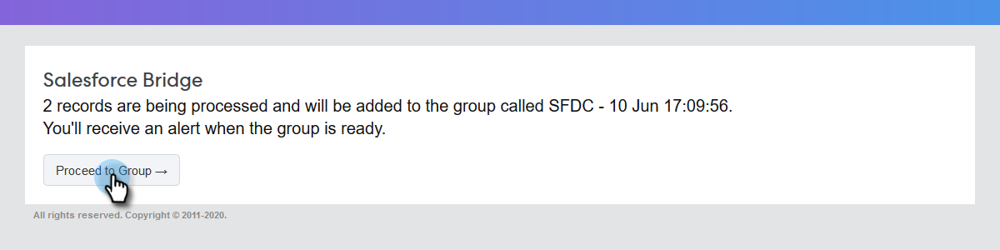

# Utilização de ações em massa no Salesforce Lightning {#using-bulk-actions-in-salesforce-lightning}

Saiba como executar ações em massa, como adicionar leads a uma campanha, enviar um email em massa ou enviar leads do Salesforce para o Sales Connect.

>[!PREREQUISITES]
>
>Atualize para a versão mais recente do pacote Sales Connect e instale os botões de ação em massa na exibição de lead/contato. [Clique aqui para obter instruções](https://s3.amazonaws.com/tout-user-store/salesforce/assets/SF+Guide+for+Lightning.pdf).

>[!NOTE]
>
>Antes de seguir as etapas abaixo, verifique se você está conectado à sua conta Marketo Sales Connect.

## Email em massa {#bulk-email}

1. No Salesforce, clique na guia **Clientes potenciais** e escolha a lista de clientes potenciais desejados.

   

   >[!NOTE]
   >
   >Se você já estiver na lista que será usada, precisará executá-la novamente escolhendo-a no menu suspenso para garantir que os botões de ação em massa do MSC sejam exibidos. Esse é um comportamento do Salesforce que não pode ser alterado.

1. Clique na lista suspensa de setas (na extremidade direita da tela) e selecione **Email with MSC**.

   

1. Um email do MSC será exibido. Ele inclui os seguintes recursos:

   a. O campo &quot;Até&quot; mostra &quot;Todos os recebimentos&quot; - isso corresponde à lista de clientes em potencial escolhida na Exibição da Lista de Clientes Potenciais\
   b. Esta lista está visível no painel esquerdo chamado &quot;Composição em massa&quot; - você pode adicionar/remover destinatários aqui\
   c. Você pode escolher um modelo ou criar seu próprio email\
   d. Você pode enviar o email imediatamente ou agendar o envio posteriormente

   

## Adicionar à campanha {#add-to-campaign}

1. No Salesforce, clique na guia **Clientes potenciais** e escolha a lista de clientes potenciais desejados.

   

1. Clique na lista suspensa de setas (na extremidade direita da tela) e selecione **Adicionar à campanha MSC**.

   

1. Um pop-up &quot;Adicionar pessoas à sua campanha&quot; será exibido. Clique em **Avançar** e passe pelo fluxo de campanha típico para acionar uma campanha MSC.

   

## Enviar por push ao Marketo Sales Connect {#push-to-marketo-sales-connect}

1. No Salesforce, clique na guia **Clientes potenciais** e escolha a lista de clientes potenciais desejados.

   

1. Clique na lista suspensa de setas (na extremidade direita da tela) e selecione **Enviar para o MSC**.

   

1. Uma nova guia chamada &quot;Salesforce Bridge&quot; será aberta. Clique no botão **Prosseguir para o grupo →**.

   

1. Você será encaminhado para sua conta MSC, onde verá um grupo criado com carimbo de data/hora. Você receberá uma notificação quando a sincronização estiver concluída e o grupo incluirá os clientes em potencial sincronizados do Salesforce.

   

>[!NOTE]
>
>Você pode seguir as mesmas etapas para usar ações em massa na Exibição da lista de contatos também.

>[!MORELIKETHIS]
>
>* [Enviando Emails por Email de Grupo](/help/marketo/product-docs/marketo-sales-connect/email/using-the-compose-window/sending-emails-via-group-email.md)
>* [Compondo Emails em Massa com Selecionar e Enviar](/help/marketo/product-docs/marketo-sales-connect/email/using-the-compose-window/composing-bulk-emails-with-select-and-send.md#sending-emails)
