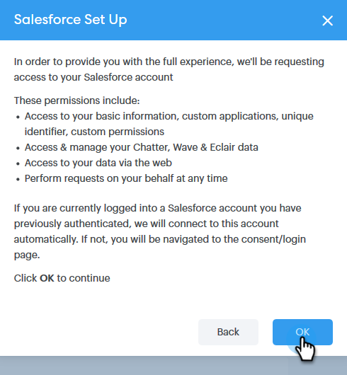

# Conecte sua conta do Sales Connect à Salesforce {#connect-your-sales-connect-account-to-salesforce}

Siga estas etapas simples para conectar [!DNL Sales Connect] a [!DNL Salesforce].

## Como se conectar como administrador {#how-to-connect-as-an-admin}

1. Em [!DNL Sales Connect], clique no ícone de engrenagem no canto superior direito e selecione **[!UICONTROL Configurações]**.

   

1. Em [!UICONTROL  Configurações de Administração], clique em **[!UICONTROL Salesforce]**.

   

1. Na guia [!UICONTROL Conexões e personalizações], clique em **[!UICONTROL Conectar]**.

   

1. Clique em **[!UICONTROL OK]**.

   

1. Se você já estiver conectado ao Salesforce, estará conectado. Caso não esteja, você será solicitado a fazer logon.

## Como se conectar como um não administrador {#how-to-connect-as-a-non-admin}

1. Em [!DNL Sales Connect], clique no ícone de engrenagem e selecione **[!UICONTROL Configurações]**.

   

1. Em [!UICONTROL Minha conta], selecione **[!UICONTROL Salesforce]**.

   

1. Na guia [!UICONTROL Conexões e personalizações], clique em **[!UICONTROL Conectar]**.

   

1. Clique em **[!UICONTROL OK]**.

   

1. Se você já estiver conectado ao Salesforce, estará conectado. Caso não esteja, você será solicitado a fazer logon.
