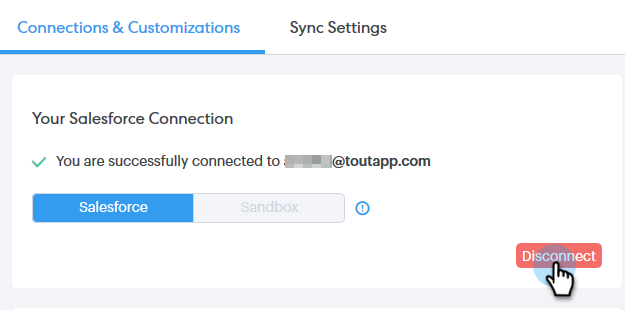

# Desconectar o Salesforce da sua conta do Sales Connect {#disconnect-salesforce-from-your-sales-connect-account}

Às vezes, pode ser necessário desconectar a conta do [!DNL &#x200B; Salesforce] da conta do [!DNL Sales Connect]. Veja como.

## Como se desconectar do Salesforce como administrador {#how-to-disconnect-from-salesforce-as-an-admin}

1. Em [!DNL Sales Connect], clique no ícone de engrenagem no canto superior direito e selecione **[!UICONTROL Configurações]**.

   

1. Em [!UICONTROL &#x200B; Configurações de Administração], clique em **[!UICONTROL Salesforce]**.

   

1. Na guia [!UICONTROL Conexões e Personalizações], clique em **[!UICONTROL Desconectar]**.

   

## Como se desconectar do Salesforce como um usuário não administrativo {#how-to-disconnect-from-salesforce-as-a-non-admin}

1. Em [!DNL &#x200B; Sales Connect], clique no ícone de engrenagem no canto superior direito e selecione **[!UICONTROL Configurações]**.

   

1. Em [!UICONTROL Minha conta], selecione **[!UICONTROL Salesforce]**.

   

1. Na guia [!UICONTROL Conexões e Personalizações], clique em **[!UICONTROL Desconectar]**.

   
