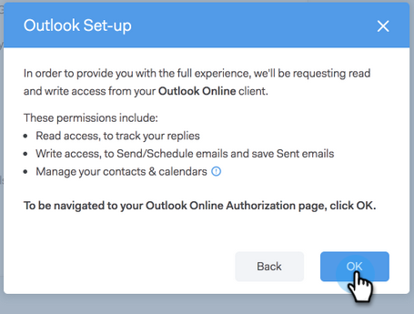

# Conexão de email para [!DNL Outlook] usuários {#email-connection-for-outlook-users}

Saiba como conectar sua conta do [!DNL Sales Connect] ao [!DNL Outlook].

>[!NOTE]
>
>Cada usuário precisa se conectar a [!DNL Outlook] de sua conta [!DNL Sales Connect].

## Conectando ao [!DNL Outlook] Online {#connecting-to-outlook-online}

Conectar-se ao [!DNL Outlook] significa que você receberá o controle de respostas, o acesso ao canal de entrega [!DNL Outlook], a capacidade de agendar emails no [!DNL Outlook] e enviar informações de conformidade.

1. Em [!DNL Sales Connect], clique no ícone de engrenagem e selecione **[!UICONTROL Configurações]**.

   

1. Em Minha conta, selecione **[!UICONTROL Configurações de email]**.

   

1. Clique na guia **[!UICONTROL Conexão de email]**.

   

1. Clique em **[!UICONTROL Começar]**.

   

1. Selecione **[!UICONTROL Eu uso o Outlook para enviar emails]** e clique em **[!UICONTROL Avançar]**.

   

1. Selecione a versão do [!DNL Outlook] que você está usando e clique em **[!UICONTROL Avançar]**. Neste exemplo, estamos escolhendo [!DNL Outlook Online].

   

   <table>
    <tbody>
     <tr>
      <td><strong>[!DNL Outlook Online]</strong></td>
      <td>Também conhecido como [!DNL Exchange Online]</td>
     </tr>
     <tr>
      <td><strong>[!DNL Exchange On-premise]</strong></td>
      <td>Inclui [!DNL Exchange] 2013 e 2016</td>
     </tr>
    </tbody>
   </table>

   >[!NOTE]
   >
   >No momento, a Marketo não oferece suporte a contas do [!DNL Exchange Hybrid].

1. Clique em **[!UICONTROL OK]**.

   

1. Se você não estiver conectado no [!DNL Outlook], digite suas informações de logon e clique em **[!UICONTROL Avançar]**. Se você estiver, escolha a conta à qual deseja se conectar e clique em **[!UICONTROL Avançar]**. Neste exemplo, já estamos conectados.

   

1. Clique em **[!UICONTROL Aceitar]**.

   

   Você pode usar essa conexão para rastrear emails e também como um canal de delivery.

   >[!NOTE]
   >
   >[!DNL Outlook Online (Office365)] impõe seus próprios limites de envio. [Saiba mais aqui](/help/marketo/product-docs/marketo-sales-connect/email/email-delivery/email-connection-throttling.md#email-provider-limits).

## Conectando a [!DNL Exchange On-Premise] {#connecting-to-exchange-on-premise}

Conectar-se ao [!DNL Exchange On-Premise] significa que você receberá o controle de respostas, o acesso ao canal de entrega [!DNL Outlook], a capacidade de agendar emails no [!DNL Outlook] e enviar informações de conformidade.

1. Em [!DNL Sales Connect], clique no ícone de engrenagem e selecione **[!UICONTROL Configurações]**.

   

1. Em [!UICONTROL Minha conta], selecione **[!UICONTROL Configurações de email]**.

   

1. Clique na guia **[!UICONTROL Conexão de email]**.

   

1. Clique em **[!UICONTROL Começar]**.

   

1. Selecione **[!UICONTROL Eu uso o Outlook para enviar emails]** e clique em **[!UICONTROL Avançar]**.

   

1. Selecione a versão do [!DNL Outlook] que você está usando e clique em **[!UICONTROL Avançar]**. Neste exemplo, estamos escolhendo [!DNL Exchange On-premise].

   

   <table>
    <tbody>
     <tr>
      <td><strong>[!DNL Outlook Online]</strong></td>
      <td>Também conhecido como [!DNL Exchange Online]</td>
     </tr>
     <tr>
      <td><strong>[!DNL Exchange On-premise]</strong></td>
      <td>Inclui [!DNL Exchange] 2013 e 2016</td>
     </tr>
    </tbody>
   </table>

1. Insira suas credenciais e clique em **[!UICONTROL Conectar]**.

   

   >[!NOTE]
   >
   >Se você desativar a Descoberta Automática no menu suspenso Versão [!DNL Exchange], precisará solicitar a URL [!DNL Exchange] ao seu departamento de TI.

   Você pode usar essa conexão para rastrear emails e também como um canal de delivery.

   >[!NOTE]
   >
   >Ao usar o [!DNL Exchange On-prem], sua equipe de TI estabelecerá seu limite de envio de email.
