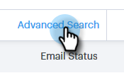
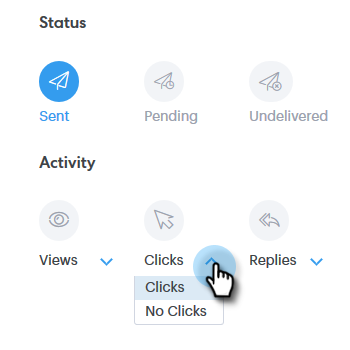

# Visão geral da pesquisa avançada {#advanced-search-overview}

Ao utilizar a pesquisa avançada para prospectos de públicos alvos que visualizaram, clicaram ou responderam a e-mails, você pode criar uma lista direcionada dos prospectos mais envolvidos.

## Como acessar a pesquisa avançada {#how-to-access-advanced-search}

1. Clique em Central **de comando**.

   

1. Clique em **Emails**.

   

1. Escolha sua guia aplicável.

   

1. Clique em Pesquisa **** avançada.

   

## Filtros {#filters}

**Data**

Escolha o intervalo de datas para sua pesquisa. As datas predefinidas são atualizadas dependendo do status de email escolhido (Enviado, Não entregue, Pendente).

**who**

Filtre por recipient/remetente de email na seção Quem.

| **Visualização como** | Filtrar por um remetente específico na instância do Sales Connect (essa opção está disponível somente para Administradores). |
|---|---|
| **Por grupo** | Filtre emails por um grupo específico de recipient. |
| **Por Pessoa** | Filtrar por um recipient específico. |

**When**

Escolha por data de criação, data de entrega, data de falha ou data programada. As opções disponíveis mudam dependendo do status de email escolhido (Enviado, Não entregue, Pendente).

**Campanhas**

Filtre e-mails por participação de campanha.

**Status**

Há três status de email para escolher. As opções de tipo/atividade mudam com base no status selecionado.

***Status: Enviados***

Filtros por sua atividade de e-mail enviada. Você pode escolher visualizações/sem visualizações, cliques/sem cliques e/ou respostas/sem respostas.

***Status: Pendente***

Filtros por todos os emails pendentes.

| **Agendado** | Emails que foram agendados da janela de composição (Salesforce ou Web App), plug-ins de e-mail ou uma campanha. |
|---|---|
| **Rascunhos** | Emails que estão atualmente em estado de rascunho. Os emails exigem uma linha de assunto e um recipient para serem salvos como rascunho. |
| **Em andamento** | Emails que estão sendo enviados. Os emails não devem permanecer nesse estado por mais de alguns segundos. |

***Status: Não entregue***

Filtros por e-mails que nunca foram entregues.

| **Falha** | Quando um email não é enviado do Sales Connect (motivos comuns incluem: e-mails sendo enviados para contatos cancelados/bloqueados ou se houver um problema ao preencher os campos dinâmicos). |
|---|---|
| **Rejeitado** | Um email é marcado como retorcido quando é rejeitado pelo servidor do recipient. Somente emails que foram enviados pelos servidores do Sales Connect serão mostrados aqui. |
| **Spam** | Quando o email foi marcado como spam (termo comum para email não solicitado) pelo recipient. Somente emails que foram enviados pelos servidores do Sales Connect serão mostrados aqui. |

## Pesquisas salvas {#saved-searches}

Veja como criar uma pesquisa salva.

1. Depois que todos os filtros estiverem no lugar, clique em **Salvar Filtros como**.

   

1. Dê um nome à sua pesquisa e clique em **Salvar**.

   

   Suas pesquisas salvas estarão na barra lateral à esquerda.

   

