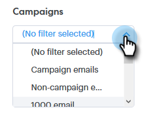

# Visão geral da pesquisa avançada {#advanced-search-overview}

Ao utilizar a pesquisa avançada para direcionar os clientes potenciais que visualizaram, clicaram ou responderam a emails, você pode criar uma lista direcionada dos clientes potenciais mais envolvidos.

## Como acessar a pesquisa avançada {#how-to-access-advanced-search}

1. Clique em **Centro de comando**.

   

1. Clique em **Emails**.

   

1. Escolha a guia aplicável.

   

1. Clique em **Pesquisa avançada**.

   

## Filtros {#filters}

**Data**

Escolha o intervalo de datas para sua pesquisa. As datas predefinidas são atualizadas dependendo do status do email escolhido (Enviado, Não entregue, Pendente).

**Quem**

Filtre por recipient/remetente de email na seção Quem .

| Lista suspensa | Descrição |
|---|---|
| **Exibir como** | Filtrar por um remetente específico na instância do Sales Connect (essa opção está disponível somente para Administradores). |
| **Por grupo** | Filtre emails por um grupo específico de recipients. |
| **Por Pessoa** | Filtrar por um recipient específico. |

**Quando**

Escolha por data de criação, data de entrega, data de falha ou data programada. As opções disponíveis mudam, dependendo do status do email escolhido (Enviado, Não entregue, Pendente).

**Campanhas**

Filtre emails por participação de campanha.

**Status**

Há três status de email para escolher. As opções de tipo/atividade são alteradas com base no status selecionado.

***Status: Enviado***

Filtros por atividade de email enviada. Você pode escolher exibições/nenhuma exibição, cliques/nenhum clique e/ou respostas/nenhuma resposta.

***Status: Pending***

Filtra por todos os emails pendentes.

| Status | Descrição |
|---|---|
| **Agendado** | Emails que foram agendados a partir da janela de composição (Salesforce ou o Web App), plug-ins de email ou uma campanha. |
| **Rascunhos** | Emails que estão atualmente no estado de rascunho. Os emails exigem uma linha de assunto e um recipient para serem salvos como rascunho. |
| **em andamento** | Emails que estão sendo enviados. Os emails não devem permanecer nesse estado por mais de alguns segundos. |

***Status: Não entregue***

Filtros por emails que nunca foram entregues.

| Status | Descrição |
|---|---|
| **Falha** | Quando um email não é enviado do Sales Connect (os motivos comuns incluem: emails sendo enviados para contatos cancelados/bloqueados ou se houver um problema ao preencher os campos dinâmicos). |
| **Devolvido** | Um email é marcado como retornado quando é rejeitado pelo servidor do recipient. Somente emails que foram enviados via servidores do Sales Connect serão mostrados aqui. |
| **Spam** | Quando o email foi marcado como spam (termo comum para email não solicitado) pelo recipient. Somente emails que foram enviados via servidores do Sales Connect serão mostrados aqui. |

## Pesquisas salvas {#saved-searches}

Veja como criar uma pesquisa salva.

1. Depois que todos os filtros estiverem em vigor, clique em **Salvar filtros como**.

   

1. Dê um nome à pesquisa e clique em **Salvar**.

   

   Suas pesquisas salvas estarão na barra lateral à esquerda.

   
