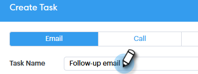
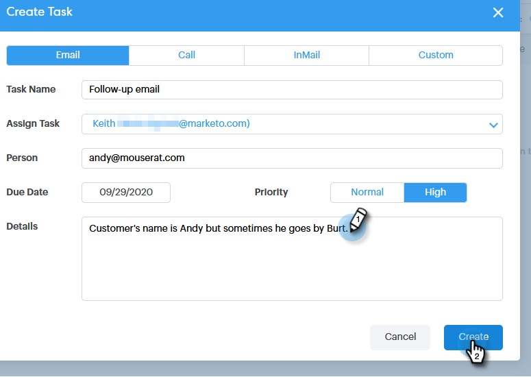

# Atribuindo Tarefas a membros da equipe {#assigning-tasks-to-team-members}

Se você quiser colaborar com outros membros da equipe, atribuir tarefas pode ser uma excelente forma de coordenar seus esforços de prospecção.

>[!NOTE]
>
>Você só pode atribuir tarefas para contatos compartilhados. Você desejará [compartilhar um grupo de contatos](/help/marketo/product-docs/marketo-sales-connect/people/managing-contacts/how-to-share-a-group.md) com os membros da sua equipe antes de colaborar com tarefas compartilhadas.

1. Clique no **Centro de Comando**.

   

1. Clique em **Adicionar Tarefa**.

   

1. Selecione o tipo de tarefa.

   

1. Dê um nome à sua tarefa.

   

1. Selecione a pessoa em sua equipe à qual deseja atribuir a tarefa no campo Atribuir Tarefa.

   

1. Adicione a pessoa à qual você deseja entrar em contato no campo de pessoa.

   

1. Selecione a Data de Vencimento.

   

1. Defina a prioridade.

   

1. Adicione todos os detalhes importantes que sejam relevantes para seu companheiro de equipe (opcional) e clique em **Criar**.

   

>[!MORELIKETHIS]
>
>[Como compartilhar um grupo](/help/marketo/product-docs/marketo-sales-connect/people/managing-contacts/how-to-share-a-group.md)
