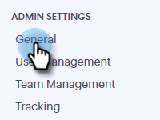

# Limitação de conexão de email {#email-connection-throttling}

A integração da sua conta [!DNL Sales Connect] para envio por meio do [!DNL Exchange] ou de provedores de email do Gmail oferece uma configuração simplificada e otimiza a capacidade de entrega de emails para 1:1 comunicação de vendas. No entanto, para manter a integridade dos sistemas e a segurança das contas, o Gmail e o Exchange impõem limites de envio de email. Esses limites podem ser aumentados ou diminuídos a critério dos provedores.

## Visão geral {#overview}

A Limitação da Conexão de Email permite que administradores do [!DNL Sales Connect] configurem a taxa de envio de emails ao usar o Gmail ou o [!DNL Exchange] como canal de entrega, para que a taxa na qual os emails sejam entregues ao provedor de canal de entrega não exceda os limites impostos.

Quando os limites são constantemente excedidos, isso pode ser visto às vezes como um comportamento suspeito do provedor de canal de entrega, causando falha nos emails e, às vezes, até mesmo uma conta é desativada.

**Notas/Destaques**

* Habilitado automaticamente quando um usuário se conecta ao Gmail ou [!DNL Exchange]
* Pode ser personalizado se você quiser aumentar ou diminuir as configurações da recomendação para atender às suas necessidades
* Apenas acelera emails enviados pelo Gmail ou [!DNL Exchange], não acelera o canal de entrega personalizado
* A limitação da Conexão de email enfileira emails de cada usuário individual separadamente, pois cada usuário tem sua própria conexão com o provedor de email

**Definindo as Configurações de Limitação da Conexão de Email**

1. Clique no ícone de engrenagem e selecione **[!UICONTROL Configurações]**.

   

1. Clique em **[!UICONTROL Geral]**.

   

1. No cartão de Limitação de conexão de email, insira o tamanho de lote desejado de emails que serão enviados para o provedor de canal de email.

   

1. Defina o tempo de espera antes do envio de cada lote. Neste exemplo, estamos escolhendo 25 emails a cada 45 segundos.

   

1. Clique em **[!UICONTROL Salvar]**.

   

Com as alterações salvas, todos os usuários terão seus emails enviados em lotes para a conta do Gmail ou do [!DNL Exchange] conectada para entrega.

## Limites do provedor de email {#email-provider-limits}

**[!DNL Outlook 365]**

Business/Empresa

* 10 mil por dia
* 30 por minuto
* 500 recipients por email

Mais informações [podem ser encontradas aqui](https://docs.microsoft.com/en-us/office365/servicedescriptions/exchange-online-service-description/exchange-online-limits?redirectedfrom=MSDN#RecipientLimits).

**Gmail**

* 2000 por dia (500 para contas de avaliação e sinalizadas)
* 2 emails por segundo (limite de API)
* 2.000 recipients por mensagem (máximo de 500 para recipients externos)

Mais informações [podem ser encontradas aqui](https://support.google.com/a/answer/166852?hl=en).

**[!DNL Microsoft Exchange Server (2010, 2013)]**

Os limites são definidos pelo departamento de TI da organização, pois o servidor é hospedado por ela. Entre em contato com o administrador da rede ou do sistema, conforme aplicável, para obter mais informações.

>[!MORELIKETHIS]
>
>* [Visão Geral Do Canal De Entrega](/help/marketo/product-docs/marketo-sales-connect/email/email-delivery/delivery-channel-overview.md)
>* [Conexão de email para usuários do Gmail](/help/marketo/product-docs/marketo-sales-connect/email-plugins/gmail/email-connection-for-gmail-users.md)
>* [Conexão de email para [!DNL Outlook] Usuários](/help/marketo/product-docs/marketo-sales-connect/email-plugins/msc-for-outlook/email-connection-for-outlook-users.md)
