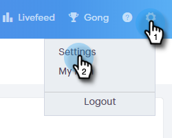

# Configuração de um canal de entrega personalizado {#setting-up-a-custom-delivery-channel}

O [!DNL Marketo Sales Connect] permite a integração com um servidor SMTP personalizado para a entrega de seus emails. Essa é uma ótima opção para aqueles que não desejam enviar emails em massa a partir do Gmail ou do canal de entrega [!DNL Exchange].

Os usuários podem configurar um servidor SMTP personalizado para seu próprio uso individual, ou os Administradores podem configurar um Team SMTP para ser compartilhado entre todos os [!DNL Sales Connect] usuários em sua instância.

>[!NOTE]
>
>* Além de configurar o servidor SMTP, sua [identidade de email deve ser verificada](/help/marketo/product-docs/marketo-sales-connect/getting-started/email-settings/verify-your-email.md) antes que você possa enviar emails.
>* Recomendamos trabalhar com sua equipe de TI ou fornecedor de servidor SMTP para obter as credenciais de servidor corretas para seu servidor SMTP.
>* Não é possível conectar o Gmail e o servidor [!DNL Exchange] usando as credenciais do servidor SMTP. Use nosso serviço de conexão de email para integrar com esses provedores.

## SMTP personalizado {#custom-smtp}

1. Faça logon no [aplicativo Web](https://toutapp.com/login), clique no ícone de engrenagem na parte superior direita e escolha **[!UICONTROL Configurações]**.

   

1. Em [!UICONTROL Minha conta], clique em **[!UICONTROL Configurações de email]**.

   

1. Clique em **[!UICONTROL Canal de entrega personalizado]**.

   

1. Insira suas credenciais do [!UICONTROL Servidor SMTP] e clique em **[!UICONTROL Conectar]**.

   

   >[!NOTE]
   >
   >Se esse for seu único canal de entrega, ele será automaticamente atribuído a todas as suas identidades de email, e você terminará aqui. Se esse não for o único canal de delivery, continue com a Etapa 5.

1. Ainda nas [!UICONTROL Configurações de email], clique em **[!UICONTROL Endereço e Assinatura]**.

   

1. Localize a identidade de email para a qual você deseja escolher um canal de entrega e clique em **[!UICONTROL Escolher Canal de Entrega]**.

   

1. No cartão [!UICONTROL Capacidade de entrega], clique em **[!UICONTROL Editar]**.

   

1. Clique no menu suspenso [!UICONTROL Canal] e escolha o canal de entrega personalizado que você acabou de adicionar. Clique em **[!UICONTROL Salvar]**.

   

   >[!NOTE]
   >
   >Se o seu administrador de equipe configurar o Team SMTP Server, ele será aplicado automaticamente apenas à sua identidade de email padrão e estará disponível como uma opção para suas outras identidades de email.

## Servidor de SMTP da equipe {#team-smtp-server}

>[!NOTE]
>
>**Permissões de administrador necessárias**

1. Faça logon no [aplicativo Web](https://toutapp.com/login), clique no ícone de engrenagem na parte superior direita e escolha **[!UICONTROL Configurações]**.

   

1. Em [!UICONTROL Configurações de Administração], clique em **[!UICONTROL Geral]**.

   

1. Clique em **[!UICONTROL Canal de entrega da equipe]**.

   

1. Insira suas credenciais do [!UICONTROL Servidor SMTP] e clique em **[!UICONTROL Conectar]**.

   

   >[!NOTE]
   >
   >O Team SMTP Server será o canal de delivery padrão da identidade de email padrão para todos os membros da equipe. Além disso, estará disponível como uma opção de canal de entrega para todas as outras identidades de email.

   >[!MORELIKETHIS]
   >
   >* [Conexão de email para usuários do Gmail](/help/marketo/product-docs/marketo-sales-connect/email-plugins/gmail/email-connection-for-gmail-users.md)
   >
   >* [Conexão de email para [!DNL Outlook] Usuários](/help/marketo/product-docs/marketo-sales-connect/email-plugins/msc-for-outlook/email-connection-for-outlook-users.md)
